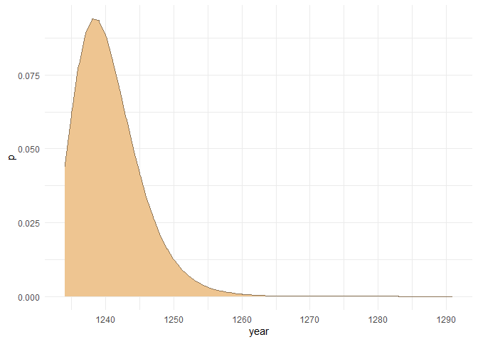
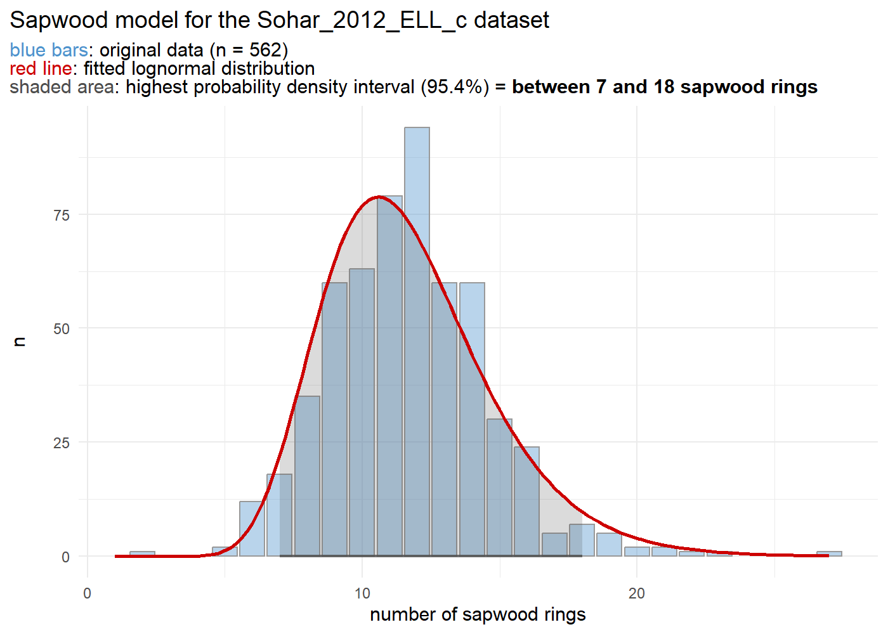
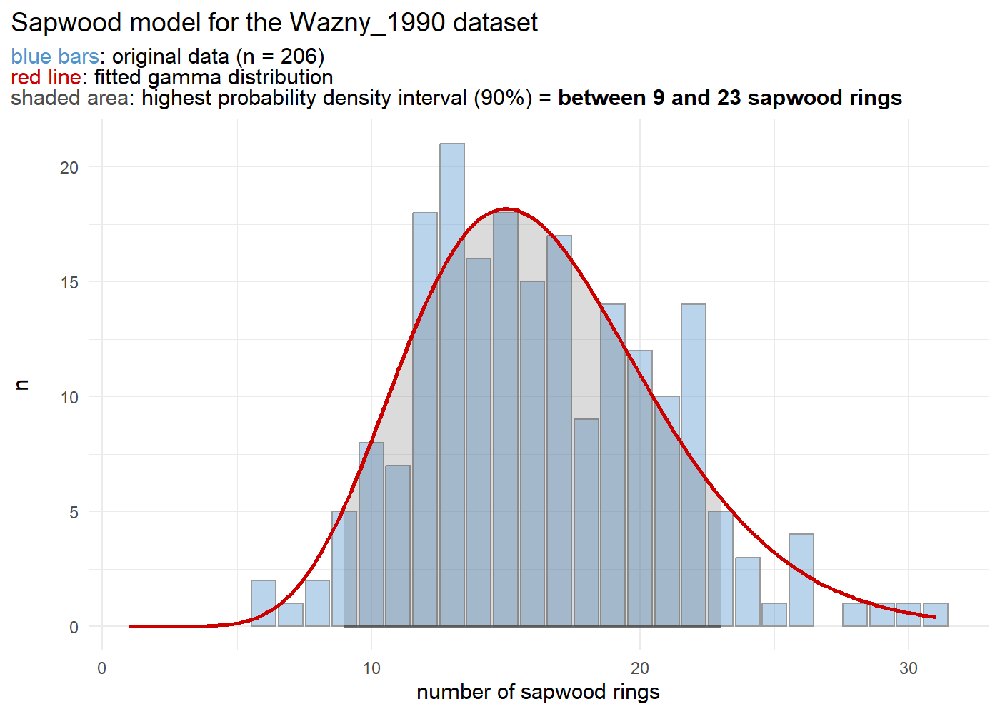

<!-- README.md is generated from README.Rmd. Please edit that file -->

# `fellingdateR`: estimating felling dates from historical tree-ring series

<!-- badges: start -->

<!-- badges: end -->

This R-package offers a set of functions that will help you to infer felling date estimates from dated tree-ring series. The presence of (partially) preserved sapwood or waney edge allows to estimate a range for the actual felling date, for individual series as well as for a group of timbers. Furthermore, an additional function provides a tool to sum sapwood probability distributions, comparable to 'summed probability densities' commonly applied to sets of radiocarbon (<sup>14</sup>C) dates.

Where it can be assumed that a group of historical timbers were all felled at the same time (i.e. the same year), but due to the absence of the bark/cambial zone (waney edge) and the last formed tree ring this cannot be assessed, the preserved sapwood rings can be used to infer a date range for the felling date. Taking into account the observed number of sapwood rings on all samples and combining them into a single estimate, is likely to provide a more accurate and precise estimate of the felling date year for the group of timbers under study. It is assumed that this estimate of the felling date is closely related to the construction date of the timber structure or building phase that was sampled for tree-ring analysis and dating.

## Installation

You can install the development version of fellingddateR from [GitHub](https://github.com/) with:

``` r
#install.packages("devtools")
devtools::install_github("hanecakr/fellingdateR")
```

## Examples

The following example shows a felling date estimate for a set of four dated tree-ring series:

``` r
library(fellingdateR)

## a data set where all series have partially preserved sapwood:
load("R/sysdata.rda")
dummy1
#>   series last n_sapwood waneyedge
#> 1  trs_1 1000         5     FALSE
#> 2  trs_2 1009        10     FALSE
#> 3  trs_3 1007        15     FALSE
#> 4  trs_4 1005        16     FALSE
#> 5  trs_5 1010         8     FALSE
```

``` r
# basic example

sw_combine(dummy1, plot = TRUE)
```


The sapwood data used in the example below was published by Hollstein in 1980:

``` r

sw_model("Hollstein_1980")
```


## Motivation

This package was developed during the analysis of a large data set of tree-ring series that originate from medieval timber constructions in the town of [Bruges](https://en.wikipedia.org/wiki/Bruges) (Belgium). The results of this study are presented in a paper published in [*Dendrochronologia*](https://www.journals.elsevier.com/dendrochronologia).

> Kristof HANECA [](https://orcid.org/0000-0002-7719-8305), Vincent DEBONNE, Patrick HOFFSUMMER 2020. The ups and downs of the building trade in a medieval city: tree-ring data as proxies for economic, social and demographic dynamics in Bruges (*c.* 1200 -- 1500). *Dendrochronologia* 64, 125773.\
> <https://doi.org/10.1016/j.dendro.2020.125773>

## Main functions

### sw_interval

This function computes the probability density function (PDF) and highest probability density interval (hdi) of the felling date range baased on the observed number of sapwood rings, their chronological dating and the selected sapwood data and model.

`sw_interval()` computes the PDF of sapwood estimates, or limits of the hdi for the felling date. In the example below, 10 sapwood rings were observed on a sample (last ring dated to 1234 AD) that is supposed to have a provenance in the Southern Baltic region (sapwood model published by Wazny, 1990). The hdi delineates an interval in which the actual felling date is most likely situated. It is the shortest interval within a probability distribution for a given probability mass or credible interval. The hdi summarizes the distribution by specifying an interval that spans most of the distribution, say 95% of it, as such that every point inside the interval has higher credibility than any point outside the interval.

``` r

sw_interval(n_sapwood = 10,
            last = 1234,
            hdi = TRUE,
            credMass = .95, 
            sw_data = "Wazny_1990", 
            densfun = "lognormal")
#>   lower upper         p
#> 1  1234  1250 0.9611797
```

When `hdi = FALSE` a matrix is returned with scaled p values for each number of observed sapwood rings.

``` r
# 10 sapwood rings observed and the Wazny 1990 sapwood model:
sw_interval(n_sapwood = 10,
            last = 1234,
            hdi = TRUE,
            credMass = .95, 
            sw_data = "Wazny_1990", 
            densfun = "lognormal",
            plot = T)
```



### fd_report

``` r
tmp <- data.frame(id = c("aaa", "bbb", "ccc"),
                 swr = c(10, 11, 12),
                 waneyedge = c(FALSE, FALSE,TRUE),
                 end = c(123, 456, 1789))
fd_report(tmp,
         series = "id",
         n_sapwood = "swr",
         last = "end",
         sw_data = "Wazny_1990")
#>   series last n_sapwood waneyedge lower upper        felling_date
#> 1    aaa  123        10     FALSE   123   139 between 123 and 139
#> 2    bbb  456        11     FALSE   456   471 between 456 and 471
#> 3    ccc 1789        12      TRUE    NA  1789             in 1789
```

### sw_combine and sw_combine_plot

``` r

dummy0
#>     trs  end swr  bark
#> 1 trs_1 1000   5 FALSE
#> 2 trs_2 1009  10 FALSE
#> 3 trs_3 1007  15 FALSE
#> 4 trs_4 1005  16 FALSE
#> 5 trs_5 1010   8 FALSE

output_comb <- sw_combine(dummy0,
   series = "trs",
   last = "end",
   n_sapwood = "swr",
   waneyedge = "bark",
   credMass = .954,
   plot = FALSE
)

head(output_comb$rawData, 20)
#>    year       trs_1      trs_2      trs_3      trs_4      trs_5       COMB
#> 1   997 0.000000000 0.00000000 0.00000000 0.00000000 0.00000000 0.00000000
#> 2   998 0.000000000 0.00000000 0.00000000 0.00000000 0.00000000 0.00000000
#> 3   999 0.000000000 0.00000000 0.00000000 0.00000000 0.00000000 0.00000000
#> 4  1000 0.002920043 0.00000000 0.00000000 0.00000000 0.00000000 0.00000000
#> 5  1001 0.007851298 0.00000000 0.00000000 0.00000000 0.00000000 0.00000000
#> 6  1002 0.015599306 0.00000000 0.00000000 0.00000000 0.00000000 0.00000000
#> 7  1003 0.025306533 0.00000000 0.00000000 0.00000000 0.00000000 0.00000000
#> 8  1004 0.035601879 0.00000000 0.00000000 0.00000000 0.00000000 0.00000000
#> 9  1005 0.045144747 0.00000000 0.00000000 0.10472609 0.00000000 0.00000000
#> 10 1006 0.052957634 0.00000000 0.00000000 0.09893475 0.00000000 0.00000000
#> 11 1007 0.058523183 0.00000000 0.09804289 0.09196367 0.00000000 0.00000000
#> 12 1008 0.061729102 0.00000000 0.09445847 0.08434543 0.00000000 0.00000000
#> 13 1009 0.062750121 0.04946162 0.08923493 0.07649959 0.00000000 0.00000000
#> 14 1010 0.061925767 0.05802159 0.08294731 0.06873926 0.02599192 0.14283134
#> 15 1011 0.059661778 0.06411934 0.07607598 0.06128498 0.03656611 0.17493731
#> 16 1012 0.056362490 0.06763182 0.06899937 0.05428134 0.04636743 0.17756885
#> 17 1013 0.052391109 0.06875047 0.06199988 0.04781326 0.05439192 0.15578431
#> 18 1014 0.048051045 0.06784729 0.05527644 0.04192076 0.06010820 0.12180221
#> 19 1015 0.043581322 0.06536681 0.04895945 0.03661131 0.06340095 0.08684045
#> 20 1016 0.039160310 0.06175203 0.04312552 0.03186987 0.06444962 0.05745784

output_comb[-1]
#> $sapwood_data
#> [1] "Hollstein_1980"
#> 
#> $sapwood_model
#> [1] "lognormal"
#> 
#> $credMass
#> [1] 0.954
#> 
#> $hdi_model
#>   lower upper         p
#> 1     6    34 0.9561277
#> 
#> $hdi_combine
#>   lower upper         p
#> 1  1010  1018 0.9741642
#> 
#> $individual_series
#>   series last n_sapwood waneyedge lower upper   A_i
#> 1  trs_1 1000         5     FALSE  1001  1029 122.0
#> 2  trs_2 1009        10     FALSE  1009  1033 132.3
#> 3  trs_3 1007        15     FALSE  1007  1029 103.9
#> 4  trs_4 1005        16     FALSE  1005  1026  78.9
#> 5  trs_5 1010         8     FALSE  1010  1036 108.5
#> 
#> $A_comb
#> Overall agreement index (%) 
#>                       117.6 
#> 
#> $A_c
#> Critical threshold (%) 
#>                     60 
#> 
#> $model_summary
#> [1] "felling date range:  1010  -  1018"
```

## Helper functions

### sw_data_overview

The function `sw_data_overview` provides an overview of all published sapwood data sets that are distributed with this package.

``` r

sw_data_overview()
#>  [1] "Brathen_1982"     "Hollstein_1980"   "Miles_1997_NM"    "Miles_1997_SC"   
#>  [5] "Miles_1997_WBC"   "Pilcher_1987"     "Sohar_2012_ELL_c" "Sohar_2012_ELL_t"
#>  [9] "Sohar_2012_FWE_c" "Sohar_2012_FWE_t" "Wazny_1990"       "vanDaalen_NLBE"  
#> [13] "vanDaalen_Norway"
```

### sw_data_info

More information on one of the sawpood data sets - how to cite the data set, the area the data represents, the number of observations and some basic summary stats - can be retrieved by the `sw_data_info` function.

``` r

sw_data_info("Pilcher_1987")
#> $data
#> [1] "Pilcher_1987"
#> 
#> $citation
#> [1] "Pilcher J.R. 1987. A 700 year dating chronology for northern France. Applications of tree-ring studies. Current research in dendrochronology and related subjects. BAR International Series 333, 127–139."
#> 
#> $area
#> [1] "Northern France"
#> 
#> $n_observations
#> [1] 116
#> 
#> $summary_raw_data
#>    Min. 1st Qu.  Median    Mean 3rd Qu.    Max. 
#>   12.00   22.00   26.00   26.72   31.00   49.00
```

### sw_model

A graphical representation of the sapwood data sets is provided by the `sw_model` function.

``` r

sw_model("Sohar_2012_ELL_c")
```



``` r

sw_data_info("Sohar_2012_ELL_c")
#> $data
#> [1] "Sohar_2012_ELL_c"
#> 
#> $citation
#> [1] "Sohar K., Vitas A. & Läänelaid A. 2012. Sapwood estimates of pedunculate oak (Quercus robur L.) in eastern Baltic, Dendrochronologia 30.1, 49–56. DOI: https://doi.org/10.1016/j.dendro.2011.08.001"
#> 
#> $area
#> [1] "Eastern Estonia, Latvia, Lithuania (sapwood determined by color)."
#> 
#> $n_observations
#> [1] 562
#> 
#> $summary_raw_data
#>    Min. 1st Qu.  Median    Mean 3rd Qu.    Max. 
#>    2.00   10.00   12.00   11.69   13.00   27.00
```

This function allows to fit a distribution to a data set of observed sapwood numbers and computes the highest posterior density interval (hdi) for a given credibility mass. The density function fitted to the sapwood data set should be one of:

-   "lognormal" (the default value),
-   "normal",
-   "weibull",
-   "gamma".

The credible interval should be a value between 0 and 1.

``` r

sw_model("Wazny_1990", densfun = "gamma", credMass= .90, plot = TRUE)
#> Warning in densfun(x, parm[1], parm[2], ...): NaNs produced
```



When `plot = FALSE`, a list with the numeric output of the modelling process is returned.

### read_fh and get_header

The `read_fh()` function is an extension to the `dplR::read.fh()` function fro the dplR package. It allows to read .fh (format Heidelberg) files of ring widths AND additionale information found in the HEADER fields are listed as attributes.

It also allows to read ring-width data in CHRONO and HALF-CHRONO format.

Furthermore, the `read_fh()` function is case insensitive.

``` r

Doel1 <- system.file("extdata", "DOEL1.fh", package = "fellingdateR")

Doel1_trs <- read_fh(Doel1, verbose = FALSE)

head(Doel1_trs, 10)
#>      K1_091 S38-BB GD3-1BB GR1mBB GQ1mBB K1_095 GG1-1BB S13mSB S13A-BB S6-SB
#> 1150     NA     NA      NA     NA   3.80     NA      NA     NA      NA    NA
#> 1151     NA     NA      NA     NA   4.15     NA      NA     NA      NA    NA
#> 1152     NA     NA      NA     NA   4.63     NA      NA     NA      NA    NA
#> 1153     NA     NA      NA     NA   4.31     NA      NA     NA      NA    NA
#> 1154     NA     NA      NA     NA   3.97     NA      NA     NA      NA    NA
#> 1155     NA     NA      NA     NA   4.10     NA      NA     NA      NA    NA
#> 1156     NA     NA      NA     NA   2.02     NA      NA     NA      NA    NA
#> 1157     NA     NA      NA     NA   3.24     NA      NA     NA      NA    NA
#> 1158   2.50     NA      NA     NA   3.75     NA      NA     NA      NA    NA
#> 1159   2.73     NA      NA     NA   3.07     NA      NA     NA      NA    NA
```

When `header = TRUE`, the `get_header` function is triggered and HEADER fields are listed as a `data.frame`.

``` r

read_fh(Doel1, verbose = FALSE, header = TRUE)
#>     series data_type         chrono_members species first last length swr
#> 1   K1_091    Single                   <NA>    QUSP  1158 1292    135  15
#> 2   S38-BB    Single                   <NA>    QUSP  1193 1306    114   0
#> 3  GD3-1BB    Single                   <NA>    QUSP  1222 1310     89   5
#> 4   GR1mBB    Quadro K1_001,K1_004x,GR1-3BB    QUSP  1220 1310     91   3
#> 5   GQ1mBB    Quadro  GQ1-2BB,K1_007,K1_009    QUSP  1150 1314    165   7
#> 6   K1_095    Single                   <NA>    QUSP  1207 1320    114  21
#> 7  GG1-1BB    Single                   <NA>    QUSP  1240 1322     83  13
#> 8   S13mSB    Quadro          S1-3SB,K1_076    QUSP  1164 1322    159  20
#> 9  S13A-BB    Single                   <NA>    QUSP  1232 1324     93  19
#> 10   S6-SB    Single                   <NA>    QUSP  1221 1324    104  14
#>    swr_note unmeasuredRings status waneyedge bark pith pith_offset
#> 1      <NA>              NA  Dated      <NA> <NA>    -          NA
#> 2      <NA>              NA  Dated      <NA> <NA>    -          NA
#> 3      <NA>              NA  Dated      <NA> <NA>    -          NA
#> 4      <NA>              NA  Dated       ---    -    -          NA
#> 5      <NA>              NA  Dated       ---    -    -          NA
#> 6      <NA>              NA  Dated      <NA>    -    -          NA
#> 7      <NA>              NA  Dated      <NA> <NA> <NA>          NA
#> 8      <NA>              NA  Dated       --- <NA>    -          NA
#> 9      <NA>               1  Dated       WKE <NA> <NA>          NA
#> 10     <NA>               1  Dated       WKE <NA> <NA>          NA
#>                                     comments             project
#> 1                                  keelplank Ship timbers DOEL 1
#> 2   HW/SW boundary | K1_281 | framing timber Ship timbers DOEL 1
#> 3                        K1_370 | hull plank Ship timbers DOEL 1
#> 4                                 hull plank Ship timbers DOEL 1
#> 5                                 hull plank Ship timbers DOEL 1
#> 6                                 inner stem Ship timbers DOEL 1
#> 7                                 hull plank                <NA>
#> 8  average of S1-3SB,K1_076 | framing timber Ship timbers DOEL 1
#> 9                             framing timber Ship timbers DOEL 1
#> 10                            framing timber                <NA>
#>                   location town  zip       street sampling_date    personal_id
#> 1        Doel_Deurganckdok <NA> <NA>         <NA>          <NA>           <NA>
#> 2        Doel_Deurganckdok <NA> <NA>         <NA>          <NA>           <NA>
#> 3        Doel_Deurganckdok <NA> <NA>         <NA>          <NA>           <NA>
#> 4        Doel_Deurganckdok Doel <NA> Deurganckdok          <NA> Kristof Haneca
#> 5        Doel_Deurganckdok Doel <NA> Deurganckdok          <NA> Kristof Haneca
#> 6        Doel_Deurganckdok Doel <NA> Deurganckdok          <NA> Kristof Haneca
#> 7  KOGGE ANTWERPEN GG1-1BB <NA> <NA>         <NA>          <NA>             EH
#> 8        Doel_Deurganckdok <NA> <NA>         <NA>          <NA>           <NA>
#> 9        Doel_Deurganckdok <NA> <NA>         <NA>          <NA>             KH
#> 10   KOGGE ANTWERPEN S6-SB <NA> <NA>         <NA>          <NA>             EH
#>    client_id longitude latitude
#> 1       <NA>      <NA>     <NA>
#> 2       <NA>      <NA>     <NA>
#> 3       <NA>      <NA>     <NA>
#> 4       <NA>      <NA>     <NA>
#> 5       <NA>      <NA>     <NA>
#> 6       <NA>      <NA>     <NA>
#> 7       <NA>      <NA>     <NA>
#> 8       <NA>      <NA>     <NA>
#> 9       <NA>      <NA>     <NA>
#> 10      <NA>      <NA>     <NA>
```
