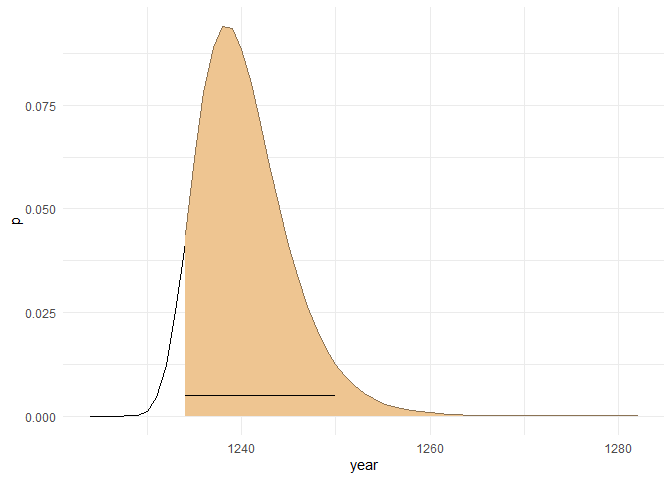
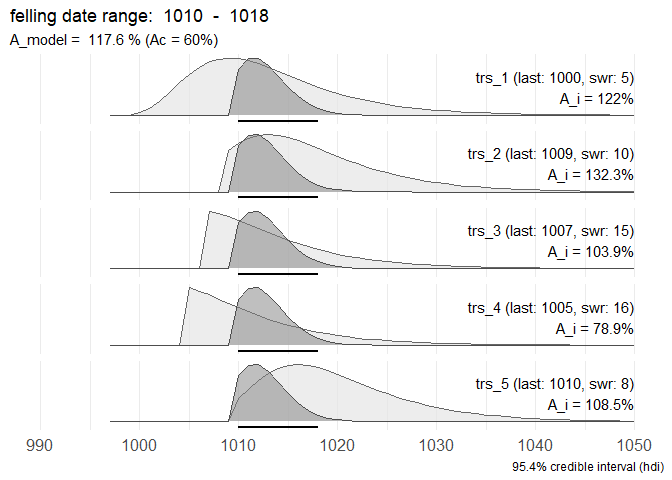
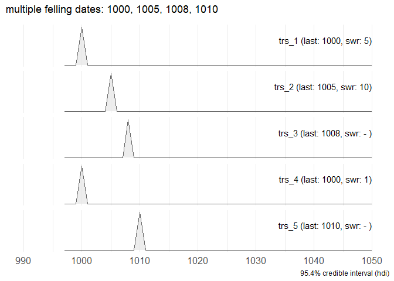
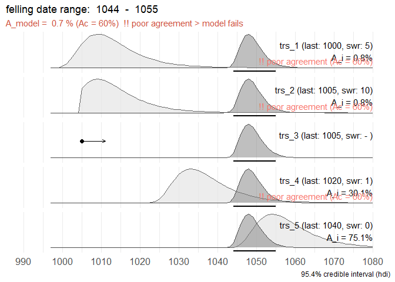

-----

title: “fellingDateR: brief overview” author: “Kristof Haneca” date: “01
juli, 2020” output: github\_document

-----

# fellingDateR: estimating felling dates from historical tree-ring series

The set of functions presented on this Github repository will help you
infer felling date estimates from dated tree-ring series with partially
preserved sapwood. Furthermore an additional function provides a tool to
sum sapwood probability distributions, comparable to ‘summed probability
densities’ commonly used for radiocarbon (<sup>14</sup>C) age
determinations.

Where it can be assumed that a group of historical timbers were all
felled at the same time (i.e. the same year), but due to the absence of
bark/cambial zone (waney edge) and the last formed tree ring this cannot
be assessed, the preserved sapwood rings on core samples can be used to
infer a date range for the felling date. Taking into account the sapwood
numbers on all samples and combining them into a single estimate, is
likely to provide a more accurate and precise estimate of the feeling
date year for the group of timber under study. It is assumed that this
estimate of the felling date is closely related to the construction date
of the structure or building phase that was sampled for tree-ring
dating.


## Motivation

These R scripts and functions were developed during the analysis of a
large set of tree-ring data that were taken from medieval timber
constructions in the town of Bruges (Belgium). The results of this study
are presented in a paper that was submitted to
[*Dendrochronologia*](https://www.journals.elsevier.com/dendrochronologia)
and is currently under peer review.

> Haneca, Kristof
> [](https://orcid.org/0000-0002-7719-8305),
> Debonne, Vincent
> [](https://orcid.org/0000-0003-4536-146X),
> Hoffsummer, Patrick, (under review). The ups and downs of the building
> trade in a medieval city: tree-ring data as proxies for economic,
> social and demographic dynamics in Bruges (c. 1200 – 1500).
> *Dendrochronologia*.

## Overview of R-functions

### sapwood\_PDF

The function `sapwood_PDF()` computes the probability density function
(PDF) for the estimated felling dated, derived from the number of
observed sapwood rings, on a e.g. a core sample of cross section, and a
chosen sapwood model that gives the probability for any number of
sapwood rings (as observed on samples with a complete pith to bark
sequence).

The examples below all rely on published sapwood models for European oak
( *Quercus robur* L. and *Quercus petraea* (Matt.) Liebl.).

The `sapwood_PDF()`-function takes 5 arguments:

  - swr = the observed number of sapwood rings on a timber
  - last = a calendar date for the last measured tree ring on a
    dendrochronologically dated sample (optional)
  - model = should be one of `c("Holstein_1980", "Wazny_1990")` (more
    models will be added later)
  - hdi = `TRUE/FALSE` whether the highest probability density interval
    (hdi) should be computed or not (relies on package `HDInterval`)
  - credMass = number \[0, 1\] that assigns the credibility mass
    associated with the hdi

Output is a `data.frame` with 3 variables:

  - `year`: ascending sequence staring at 0 when last is not set to a
    calendar year, or starting from the calendar year of the last
    observed sapwood ring
  - `swr`: ascending sequence starting at the observed number of sapwood
    rings
  - `p`: probability associated with the number of sapwood rings (swr),
    based on the sapwood model provided

<!-- end list -->

``` r
source("./R/sapwood_PDF.R")
require(tidyverse)

# 8 sapwood rings observed and the Hollstein 1980 model as a reference
sw1 <- sapwood_PDF(swr = 8, last = 1234, model = "Hollstein_1980")
ggplot(sw1) +
  geom_area(aes(x = year, y = p), fill = "burlywood2", color = "burlywood4") +
  theme_minimal()
```

<!-- -->

The hdi delineates an interval in which the actual felling date is most
likely situated. It is the shortest interval within a probability
distribution for a given probability mass or credible interval. The hdi
summarizes the distribution by specifying an interval that spans most of
the distribution, say 95% of it, such that every point inside the
interval has higher credibility than any point outside the interval.

In the example below, 10 sapwood rings were observed on a sample (last
ring dated to 1234 AD) that is supposed to have a provenance in the
Southern Baltic region (sapwood model published by Wazny, 1990). The
full sampwood model is shown with a black outline. The colored part of
the distribution shows the truncated distribution at 10 observed sawpood
rings and the horizontal line depicts the 95.4% credible interval for
the felling date of the tree.

``` r
library(HDInterval) # this package assist in computing the highest probability density interval
# https://CRAN.R-project.org/package=HDInterval 

# the 'full' sapwood model (Wazny 1990)
sw2 <- sapwood_PDF(swr = 0, last = 1224, model = "Wazny_1990")

# the 'truncated' sapwood model when 7 sapwood rings are observed
sw3 <- sapwood_PDF(swr = 10, last = 1234, model = "Wazny_1990")

# the highest probability density interval (hdi), with a credible interval of 95.4%
sw4 <- sapwood_PDF(swr = 10, last = 1234, hdi = TRUE, credMass = 0.954, model = "Wazny_1990")
sw4
#> lower upper 
#>  1234  1250 
#> attr(,"credMass")
#> [1] 0.954
#> attr(,"sapwood_model")
#> [1] "Wazny_1990"
```

``` r

ggplot(sw2) +
  geom_area(aes(x = year, y = p), fill = NA, color = "black") +
  geom_area(data = sw3, aes(x = year, y = p), fill = "burlywood2", color = "burlywood4") +
  geom_segment(aes(y = .005, yend = .005, x = sw4["lower"], xend = sw4["upper"])) +
  theme_minimal()
```

<!-- --> \#\#
sapwood\_combine()

A function that tries to estimate a single felling date for a set of
dated tree-ring series with (partly) preserved sapwood.

``` r
# some test-data

# all series have partially preserved sapwood
dummy1 <- data.frame(
  keycode = c("trs_1", "trs_2", "trs_3", "trs_4", "trs_5"),
  Date_end = c(1000, 1009, 1007, 1005, 1010),
  SWR = c(5, 10, 15, 16, 8),
  Waneyedge = c(FALSE, FALSE, FALSE, FALSE, FALSE))

# one series has an exact felling date (= waney edge preserved)
dummy2 <- data.frame(
  keycode = c("trs_1", "trs_2", "trs_3", "trs_4", "trs_5"),
  Date_end = c(1000, 1005, 1008, 1000, 1010),
  SWR = c(5, 10, NA, 1, 3),
  Waneyedge = c(FALSE, FALSE, FALSE, FALSE, TRUE))

# multiple felling dates
dummy3 <- data.frame(
  keycode = c("trs_1", "trs_2", "trs_3", "trs_4", "trs_5"),
  Date_end = c(1000, 1005, 1008, 1000, 1010),
  SWR = c(5, 10, NA, 1, NA),
  Waneyedge = c(TRUE, TRUE, TRUE, TRUE, TRUE))

# combination of series with and without sapwood rings
dummy4 <- data.frame(
  keycode = c("trs_1", "trs_2", "trs_3", "trs_4", "trs_5"),
  Date_end = c(1000, 1005, 1005, 1020, 1040),
  SWR = c(5, 10, NA, 1, 0),
  Waneyedge = c(FALSE, FALSE, FALSE, FALSE, FALSE))

# 
dummy5 <- data.frame(
  keycode = c("trs_1", "trs_2", "trs_3", "trs_4"),
  Date_end = c(1000, 1005, 1000, 1000),
  SWR = c(NA, NA, NA, NA),
  Waneyedge = c(FALSE, FALSE, FALSE, FALSE))
  
```

``` r
source("./R/sapwood_combine.R")

swc1 <- sapwood_combine(dummy1, hdi = TRUE, credMass = .90, model = "Hollstein_1990")

str(swc1)
#> List of 6
#>  $ rawData  :'data.frame':   114 obs. of  7 variables:
#>   ..$ year : num [1:114] 997 998 999 1000 1001 ...
#>   ..$ trs_1: num [1:114] 0 0 0 0.00292 0.00785 ...
#>   ..$ trs_2: num [1:114] 0 0 0 0 0 0 0 0 0 0 ...
#>   ..$ trs_3: num [1:114] 0 0 0 0 0 0 0 0 0 0 ...
#>   ..$ trs_4: num [1:114] 0 0 0 0 0 ...
#>   ..$ trs_5: num [1:114] 0 0 0 0 0 0 0 0 0 0 ...
#>   ..$ COMB : num [1:114] 0 0 0 0 0 0 0 0 0 0 ...
#>  $ A_c      : Named num 60
#>   ..- attr(*, "names")= chr "Ac: critical threshold (%)"
#>  $ A_comb   : Named num 118
#>   ..- attr(*, "names")= chr "A_comb"
#>  $ hdi_model: Named num [1:2] 1010 1016
#>   ..- attr(*, "names")= chr [1:2] "lower" "upper"
#>   ..- attr(*, "credMass")= num 0.9
#>   ..- attr(*, "sapwood_model")= chr "Hollstein_1990"
#>  $ summary  : chr [1:5, 1:5] "trs_1" "trs_2" "trs_3" "trs_4" ...
#>   ..- attr(*, "dimnames")=List of 2
#>   .. ..$ : chr [1:5] "trs_1" "trs_2" "trs_3" "trs_4" ...
#>   .. ..$ : chr [1:5] "series" "endDate" "swr" "waneyEdge" ...
#>  $ message  : chr "felling date range:  1010  -  1016"
```

## sapwood\_comb\_plot()

Plot the output of `sapwood_combine()` with `ggplot()`

This first set of tree-ring series migh share a common felling date,
situated between 1010 and 1018 AD.

``` r
source("./R/sapwood_comb_plot.R")

sapwood_comb_plot(dummy1, credMass = .954, model = "Hollstein_1990")
```

<!-- --> When a series
with preserved waney edge is dated, an exact felling date can be
determined and evaluated whether the other series with preserved sapwood
go together with this felling date.

``` r

sapwood_comb_plot(dummy2, credMass = .954, model = "Hollstein_1990")
#> Warning: Removed 343 rows containing missing values (position_stack).
#> Warning: Removed 300 rows containing missing values (position_stack).
#> Warning: Removed 60 row(s) containing missing values (geom_path).

#> Warning: Removed 60 row(s) containing missing values (geom_path).
```

<!-- -->

A data set with series that have different felling dates. No common
felling date can be presented.

``` r

sapwood_comb_plot(dummy3, credMass = .954, model = "Hollstein_1990")
#> Warning: Removed 300 rows containing missing values (position_stack).
#> Warning: Removed 60 row(s) containing missing values (geom_path).
```

<!-- -->

For this set of tree-ring series, no common felling date can be
estimated. Probably this dataset contains tree-ring series from
different building phases or includes reused older timbers.

``` r

sapwood_comb_plot(dummy4, credMass = .954, model = "Hollstein_1990")
#> Warning: Removed 376 rows containing missing values (position_stack).
#> Warning: Removed 300 rows containing missing values (position_stack).
#> Warning: Removed 60 row(s) containing missing values (geom_path).

#> Warning: Removed 60 row(s) containing missing values (geom_path).
```

<!-- -->

Ony a *terminus post quem* or ‘earliest possible felling date’ can be
computed when no sapwood is preserved.

``` r

sapwood_comb_plot(dummy5, credMass = .954, model = "Hollstein_1990")
```

<!-- -->

## sapwood\_SPD()

Computes a summed probability density from a set of tree-ring series
with (partly) preserved sapwood.
