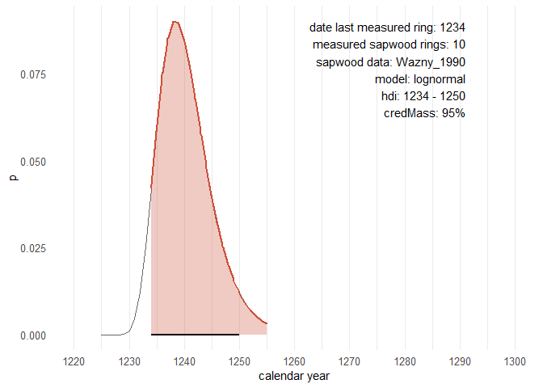
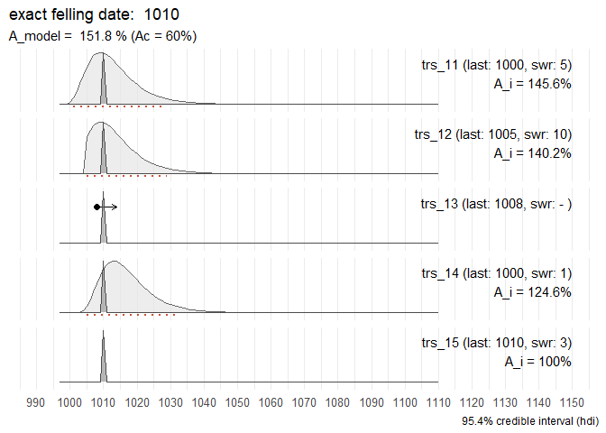
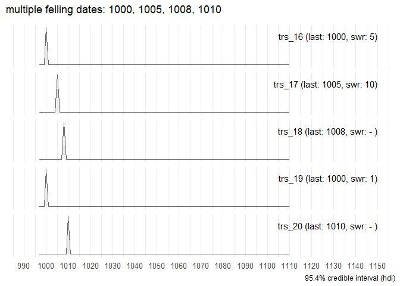
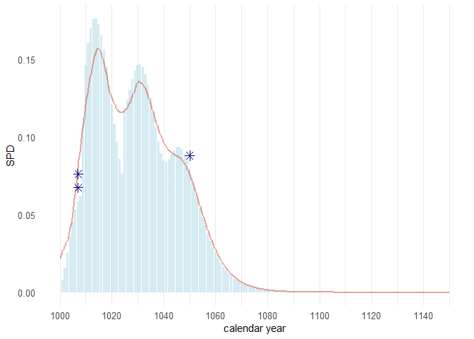
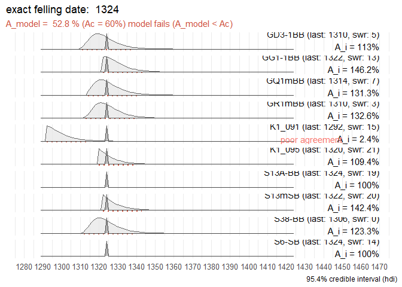
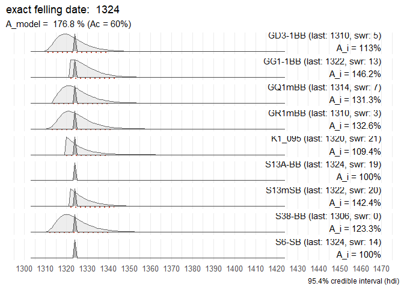

-   [`fellingdateR`: estimating felling dates from historical tree-ring series](#fellingdater-estimating-felling-dates-from-historical-tree-ring-series)
    -   [Installation](#installation)
    -   [Basic example](#basic-example)
    -   [Motivation](#motivation)
    -   [Main functions](#main-functions)
    -   [Helper functions](#helper-functions)

<!-- README.md is generated from README.Rmd. Please edit that file -->

# `fellingdateR`: estimating felling dates from historical tree-ring series {#fellingdater-estimating-felling-dates-from-historical-tree-ring-series}

<!-- badges: start -->

[](https://github.com/hanecakr/fellingDateR/actions/workflows/R-CMD-check.yaml)

<!-- badges: end -->

This R-package offers a set of functions that can assist you to infer felling date estimates from dated tree-ring series. The presence of (partially) preserved sapwood or waney edge allows to estimate a range for the actual felling date, for individual series as well as for a group of timbers. Furthermore, an additional function provides a tool to sum sapwood probability distributions, comparable to 'summed probability densities' commonly applied to sets of radiocarbon (<sup>14</sup>C) dates.


Where it can be assumed that a group of historical timbers were all felled at the same time (i.e. in the same year), but due to the absence of the bark/cambial zone (waney edge) and the last formed tree ring this cannot be assessed, the preserved sapwood rings can be used to infer a date range for the felling date.

Taking into account the observed number of sapwood rings on all samples and combining them into a single estimate, is likely to provide a more accurate and precise estimate of the felling date year for the group of timbers under study.

## Installation {#installation}

You can install the development version of fellingdateR from [GitHub](https://github.com/) with:

``` r
#install.packages("devtools")
devtools::install_github("hanecakr/fellingdateR")
```

or

``` r
pak::pak("hanecakr/fellingdateR")
```

## Basic example {#basic-example}

In the following example the combined felling date range for a set of five dated tree-ring series is computed:

``` r
library(fellingdateR)

## a data set where all series have partially preserved sapwood:
load("R/sysdata.rda")
dummy1
#>   series last n_sapwood waneyedge
#> 1 trs_06 1000         5     FALSE
#> 2 trs_07 1009        10     FALSE
#> 3 trs_08 1007        15     FALSE
#> 4 trs_09 1005        16     FALSE
#> 5 trs_10 1010         8     FALSE
```

``` r
sw_combine(dummy1, plot = TRUE)
```

 The light grey distributions represent the probability density function of the felling date range for each individual series. The dark grey distribution is the combined estimate for a common felling date.

The sapwood data used in the example above to estimate the felling date range, was published by Hollstein in 1980:

``` r
sw_model("Hollstein_1980")
```


## Motivation {#motivation}

This package was developed during the analysis of a large data set of tree-ring series that originate from medieval timber constructions in [Bruges](https://en.wikipedia.org/wiki/Bruges) (Belgium). The results of this study were published in [*Dendrochronologia*](https://www.journals.elsevier.com/dendrochronologia).

> Kristof HANECA [](https://orcid.org/0000-0002-7719-8305), Vincent DEBONNE, Patrick HOFFSUMMER 2020. The ups and downs of the building trade in a medieval city: tree-ring data as proxies for economic, social and demographic dynamics in Bruges (*c.* 1200 -- 1500). *Dendrochronologia* 64, 125773.\
> <https://doi.org/10.1016/j.dendro.2020.125773>

## Main functions {#main-functions}

### sw_interval

This function computes the probability density function (PDF) and highest probability density interval (hdi) of the felling date range based on the observed number of sapwood rings, their chronological dating and the selected sapwood data and model.

In the example below, 10 sapwood rings were observed on a sample (last ring dated to 1234 AD) that is supposed to have a provenance in the Southern Baltic region (sapwood model published by Wazny, 1990). The hdi delineates an interval in which the actual felling date is most likely situated. It is the shortest interval within a probability distribution for a given probability mass or credible interval. The hdi summarizes the distribution by specifying an interval that spans most of the distribution, say 95% of it, as such that every point inside the interval has higher credibility than any point outside the interval.

``` r
sw_interval(n_sapwood = 10,
            last = 1234,
            hdi = TRUE,
            credMass = .95, 
            sw_data = "Wazny_1990", 
            densfun = "lognormal")
#>   lower upper         p
#> 1  1234  1250 0.9611793
```

When `hdi = FALSE` a matrix is returned with scaled p values for each number of observed sapwood rings.

The results of this procedure can be visualized by setting `plot = TRUE`.

``` r
# 10 sapwood rings observed and the Wazny 1990 sapwood model:
sw_interval(n_sapwood = 10,
            last = 1234,
            hdi = TRUE,
            credMass = .95, 
            sw_data = "Wazny_1990", 
            densfun = "lognormal",
            plot = T)
```



### fd_report

Reporting estimates of the felling date range for individual series, is provided by the `fd_report()` function.

``` r
tmp <- data.frame(id = c("aaa", "bbb", "ccc"),
                 swr = c(10, 11, 12),
                 waneyedge = c(FALSE, FALSE,TRUE),
                 end = c(123, 456, 1789))
fd_report(tmp,
         series = "id",
         n_sapwood = "swr",
         last = "end",
         sw_data = "Wazny_1990")
#>   series last n_sapwood waneyedge lower upper        felling_date sapwood_model
#> 1    aaa  123        10     FALSE   123   139 between 123 and 139    Wazny_1990
#> 2    bbb  456        11     FALSE   456   471 between 456 and 471    Wazny_1990
#> 3    ccc 1789        12      TRUE    NA  1789             in 1789    Wazny_1990
```

### sw_combine

The procedure to combine felling dates of a group of related, individual series with (partially) preserved sapwood, in order to narrow down the range of a common felling date is provided by the `sw_combine()` function. It returns a list with:

-   the pdf for the felling date of the individual series and the pdf of the model that combines these individual series (`$dataRaw`),

-   the hdi for the combined estimate of the common felling date (`$hdi_model`),

-   the *Agreement index* (`$A_comb`) of the model, expressing how well the individual series fit into the model (ideally around 100%, and not lower than the critical threshold A_c = 60%) ,

-   an overview of the felling date range for the individual series (`$individual_series`), and their *Agreement index* (A_i) to the combined model.

#### dummy0

A data set with dated tree-ring series which all have partially preserved sapwood. The names of the variables in the data set are mapped to the parameters of the `sw_combine()` function. In the example below, the numeric output is returned:

``` r

dummy0
#>      trs  end swr  bark
#> 1 trs_01 1000   5 FALSE
#> 2 trs_02 1009  10 FALSE
#> 3 trs_03 1007  15 FALSE
#> 4 trs_04 1005  16 FALSE
#> 5 trs_05 1010   8 FALSE

output_comb <- sw_combine(dummy0,
   series = "trs",
   last = "end",
   n_sapwood = "swr",
   waneyedge = "bark",
   credMass = .954,
   plot = FALSE
)

head(output_comb$rawData, 20)
#>    year      trs_01     trs_02     trs_03     trs_04     trs_05       COMB
#> 1   997 0.000000000 0.00000000 0.00000000 0.00000000 0.00000000 0.00000000
#> 2   998 0.000000000 0.00000000 0.00000000 0.00000000 0.00000000 0.00000000
#> 3   999 0.000000000 0.00000000 0.00000000 0.00000000 0.00000000 0.00000000
#> 4  1000 0.002920043 0.00000000 0.00000000 0.00000000 0.00000000 0.00000000
#> 5  1001 0.007851298 0.00000000 0.00000000 0.00000000 0.00000000 0.00000000
#> 6  1002 0.015599306 0.00000000 0.00000000 0.00000000 0.00000000 0.00000000
#> 7  1003 0.025306533 0.00000000 0.00000000 0.00000000 0.00000000 0.00000000
#> 8  1004 0.035601879 0.00000000 0.00000000 0.00000000 0.00000000 0.00000000
#> 9  1005 0.045144747 0.00000000 0.00000000 0.10472609 0.00000000 0.00000000
#> 10 1006 0.052957634 0.00000000 0.00000000 0.09893475 0.00000000 0.00000000
#> 11 1007 0.058523183 0.00000000 0.09804289 0.09196367 0.00000000 0.00000000
#> 12 1008 0.061729102 0.00000000 0.09445847 0.08434543 0.00000000 0.00000000
#> 13 1009 0.062750121 0.04946162 0.08923493 0.07649959 0.00000000 0.00000000
#> 14 1010 0.061925767 0.05802159 0.08294731 0.06873926 0.02599192 0.14283134
#> 15 1011 0.059661778 0.06411934 0.07607598 0.06128498 0.03656611 0.17493731
#> 16 1012 0.056362490 0.06763182 0.06899937 0.05428134 0.04636743 0.17756885
#> 17 1013 0.052391109 0.06875047 0.06199988 0.04781326 0.05439192 0.15578431
#> 18 1014 0.048051045 0.06784729 0.05527644 0.04192076 0.06010820 0.12180221
#> 19 1015 0.043581322 0.06536681 0.04895945 0.03661131 0.06340095 0.08684045
#> 20 1016 0.039160310 0.06175203 0.04312552 0.03186987 0.06444962 0.05745784

output_comb[-1]
#> $sapwood_data
#> [1] "Hollstein_1980"
#> 
#> $sapwood_model
#> [1] "lognormal"
#> 
#> $credMass
#> [1] 0.954
#> 
#> $hdi_model
#>   lower upper         p
#> 1     6    34 0.9561277
#> 
#> $hdi_combine
#>   lower upper         p
#> 1  1010  1018 0.9741642
#> 
#> $individual_series
#>   series last n_sapwood waneyedge lower upper   A_i
#> 1 trs_01 1000         5     FALSE  1001  1029 122.0
#> 2 trs_02 1009        10     FALSE  1009  1033 132.3
#> 3 trs_03 1007        15     FALSE  1007  1029 103.9
#> 4 trs_04 1005        16     FALSE  1005  1026  78.9
#> 5 trs_05 1010         8     FALSE  1010  1036 108.5
#> 
#> $A_comb
#> Overall agreement index (%) 
#>                       117.6 
#> 
#> $A_c
#> Critical threshold (%) 
#>                     60 
#> 
#> $model_summary
#> [1] "felling date range:  1010  -  1018"
```

#### dummy2

A data set with 5 tree-ring series of which one has an exact felling date:

``` r
dummy2
#>   series last n_sapwood waneyedge
#> 1 trs_11 1000         5     FALSE
#> 2 trs_12 1005        10     FALSE
#> 3 trs_13 1008        NA     FALSE
#> 4 trs_14 1000         1     FALSE
#> 5 trs_15 1010         3      TRUE
sw_combine(dummy2, plot = TRUE)
```



#### dummy3

A data set where all tree-ring series have been measured up to the waney edge:

``` r
dummy3
#>   series last n_sapwood waneyedge
#> 1 trs_16 1000         5      TRUE
#> 2 trs_17 1005        10      TRUE
#> 3 trs_18 1008        NA      TRUE
#> 4 trs_19 1000         1      TRUE
#> 5 trs_20 1010        NA      TRUE
sw_combine(dummy3, plot = TRUE)
```



#### dummy4

An attempt to compute a common felling date for a group of tree-ring series. All series include partially preserved sapwood:

``` r
dummy4
#>   series last n_sapwood waneyedge
#> 1 trs_21 1000         5     FALSE
#> 2 trs_22 1005        10     FALSE
#> 3 trs_23 1005        NA     FALSE
#> 4 trs_24 1020         1     FALSE
#> 5 trs_25 1040         0     FALSE
sw_combine(dummy4, plot = TRUE)
```

 No common felling date can be computed for this particular data set. The model fails (agreement index of the model is below the critical threshold value (A_c) of 60%). Three series have an individual agreement index below 60%.

#### dummy5

When no sapwood rings are observed and measured, only an `earliest possible felling date` (*terminus post quem*) can be determined:

``` r
dummy5
#>   series last n_sapwood waneyedge
#> 1 trs_26 1000        NA     FALSE
#> 2 trs_27 1005        NA     FALSE
#> 3 trs_28 1000        NA     FALSE
#> 4 trs_29 1000        NA     FALSE
sw_combine(dummy5, plot = TRUE)
```


### sw_sum

The `sw_sum()` function computes the the summed probability density (SPD) for a set of felling date ranges.

``` r
sw_sum(dummy7, plot = TRUE)
```



## Helper functions {#helper-functions}

### sw_data_overview

The function `sw_data_overview()` provides an overview of all published sapwood data sets that are distributed with this package.

``` r
sw_data_overview()
#>  [1] "Brathen_1982"     "Hollstein_1980"   "Miles_1997_NM"    "Miles_1997_SC"   
#>  [5] "Miles_1997_WBC"   "Pilcher_1987"     "Sohar_2012_ELL_c" "Sohar_2012_ELL_t"
#>  [9] "Sohar_2012_FWE_c" "Sohar_2012_FWE_t" "Wazny_1990"       "vanDaalen_NLBE"  
#> [13] "vanDaalen_Norway"
```

Load the original data with, e.g. `get("Hollstein_1980")`.

### sw_data_info

More information on one of the sapwood data sets - how to cite the data set, the area the data represents, the number of observations and some basic summary stats - can be retrieved by the `sw_data_info()` function.

``` r
sw_data_info("Pilcher_1987")
#> $data
#> [1] "Pilcher_1987"
#> 
#> $citation
#> [1] "Pilcher J.R. 1987. A 700 year dating chronology for northern France. Applications of tree-ring studies. Current research in dendrochronology and related subjects. BAR International Series 333, 127–139."
#> 
#> $area
#> [1] "Northern France"
#> 
#> $n_observations
#> [1] 116
#> 
#> $summary_raw_data
#>    Min. 1st Qu.  Median    Mean 3rd Qu.    Max. 
#>   12.00   22.00   26.00   26.72   31.00   49.00
```

### sw_model

A graphical representation of a sapwood data set is provided by the `sw_model()` function.

``` r

sw_model("Sohar_2012_ELL_c")
```


``` r

sw_data_info("Sohar_2012_ELL_c")
#> $data
#> [1] "Sohar_2012_ELL_c"
#> 
#> $citation
#> [1] "Sohar K., Vitas A. & Läänelaid A. 2012. Sapwood estimates of pedunculate oak (Quercus robur L.) in eastern Baltic, Dendrochronologia 30.1, 49–56. DOI: https://doi.org/10.1016/j.dendro.2011.08.001"
#> 
#> $area
#> [1] "Eastern Estonia, Latvia, Lithuania (sapwood determined by color)."
#> 
#> $n_observations
#> [1] 562
#> 
#> $summary_raw_data
#>    Min. 1st Qu.  Median    Mean 3rd Qu.    Max. 
#>    2.00   10.00   12.00   11.69   13.00   27.00
```

The `sw_model()` function allows to fit a distribution to a data set of observed sapwood numbers and computes the highest posterior density interval (hdi) for a given credibility mass. The density function fitted to the sapwood data set should be one of:

-   "lognormal" (the default value),
-   "normal",
-   "weibull",
-   "gamma".

The credible interval should be a value between 0 and 1.

``` r
sw_model("Wazny_1990", densfun = "gamma", credMass= .90, plot = TRUE)
#> Warning in densfun(x, parm[1], parm[2], ...): NaNs produced
```


When `plot = FALSE`, a list with the numeric output of the modelling process is returned.

### read_fh and get_header

The `read_fh()` function is an extension to the `dplR::read.fh()` function from the [**dplR package**](https://github.com/AndyBunn/dplR) ([Bunn 2008](https://doi.org/10.1016/j.dendro.2008.01.002), [Bunn 2010](https://doi.org/10.1016/j.dendro.2009.12.001), [Bunn *et al.* 2022](https://github.com/AndyBunn/dplR)). It allows to read .fh (format Heidelberg) files of ring widths AND additional information found in the HEADER fields are listed as attributes.

This function also works with ring-width data in CHRONO and HALF-CHRONO format.

Furthermore, the `read_fh()` function is case insensitive.

In the example below, an .fh file with dated tree-ring series from a medieval ship DOEL1 is read with `read_fh()`. The ring width measurement, in different formats, are converted to a `data.frame`.

``` r
Doel1 <- system.file("extdata", "DOEL1.fh", package = "fellingdateR")

Doel1_trs <- read_fh(Doel1, verbose = FALSE)

head(Doel1_trs, 15)
#>      K1_091 S38-BB GD3-1BB GR1mBB GQ1mBB K1_095 GG1-1BB S13mSB S13A-BB S6-SB
#> 1150     NA     NA      NA     NA   3.80     NA      NA     NA      NA    NA
#> 1151     NA     NA      NA     NA   4.15     NA      NA     NA      NA    NA
#> 1152     NA     NA      NA     NA   4.63     NA      NA     NA      NA    NA
#> 1153     NA     NA      NA     NA   4.31     NA      NA     NA      NA    NA
#> 1154     NA     NA      NA     NA   3.97     NA      NA     NA      NA    NA
#> 1155     NA     NA      NA     NA   4.10     NA      NA     NA      NA    NA
#> 1156     NA     NA      NA     NA   2.02     NA      NA     NA      NA    NA
#> 1157     NA     NA      NA     NA   3.24     NA      NA     NA      NA    NA
#> 1158   2.50     NA      NA     NA   3.75     NA      NA     NA      NA    NA
#> 1159   2.73     NA      NA     NA   3.07     NA      NA     NA      NA    NA
#> 1160   2.27     NA      NA     NA   4.19     NA      NA     NA      NA    NA
#> 1161   1.44     NA      NA     NA   3.74     NA      NA     NA      NA    NA
#> 1162   1.47     NA      NA     NA   4.54     NA      NA     NA      NA    NA
#> 1163   2.29     NA      NA     NA   4.61     NA      NA     NA      NA    NA
#> 1164   2.83     NA      NA     NA   3.91     NA      NA   1.84      NA    NA
```

When `header = TRUE`, the `get_header()` function is triggered and HEADER fields in the .fh file are returned as a `data.frame`, instead of the ring-width measurements.

``` r
read_fh(Doel1, verbose = FALSE, header = TRUE)
#>     series data_type         chrono_members species first last length n_sapwood
#> 1   K1_091    Single                   <NA>    QUSP  1158 1292    135        15
#> 2   S38-BB    Single                   <NA>    QUSP  1193 1306    114         0
#> 3  GD3-1BB    Single                   <NA>    QUSP  1222 1310     89         5
#> 4   GR1mBB    Quadro K1_001,K1_004x,GR1-3BB    QUSP  1220 1310     91         3
#> 5   GQ1mBB    Quadro  GQ1-2BB,K1_007,K1_009    QUSP  1150 1314    165         7
#> 6   K1_095    Single                   <NA>    QUSP  1207 1320    114        21
#> 7  GG1-1BB    Single                   <NA>    QUSP  1240 1322     83        13
#> 8   S13mSB    Quadro          S1-3SB,K1_076    QUSP  1164 1322    159        20
#> 9  S13A-BB    Single                   <NA>    QUSP  1232 1324     93        19
#> 10   S6-SB    Single                   <NA>    QUSP  1221 1324    104        14
#>    n_sapwood_chr unmeasured_rings invalid_rings status waneyedge bark pith
#> 1           <NA>               NA            NA  Dated      <NA> <NA>    -
#> 2           <NA>               NA            NA  Dated      <NA> <NA>    -
#> 3           <NA>               NA            NA  Dated      <NA> <NA>    -
#> 4           <NA>               NA            NA  Dated       ---    -    -
#> 5           <NA>               NA            NA  Dated       ---    -    -
#> 6           <NA>               NA            NA  Dated      <NA>    -    -
#> 7           <NA>               NA            NA  Dated      <NA> <NA> <NA>
#> 8           <NA>               NA            NA  Dated       --- <NA>    -
#> 9           <NA>               NA             1  Dated       WKE <NA> <NA>
#> 10          <NA>               NA             1  Dated       WKE <NA> <NA>
#>    pith_offset pith_offset_delta                                  comments
#> 1           NA                NA                                 keelplank
#> 2           NA                NA  HW/SW boundary | K1_281 | framing timber
#> 3           NA                NA                       K1_370 | hull plank
#> 4           NA                NA                                hull plank
#> 5           NA                NA                                hull plank
#> 6           NA                NA                                inner stem
#> 7           NA                NA                                hull plank
#> 8           NA                NA average of S1-3SB,K1_076 | framing timber
#> 9           NA                NA                            framing timber
#> 10          NA                NA                            framing timber
#>                project                location town  zip       street
#> 1  Ship timbers DOEL 1       Doel_Deurganckdok <NA> <NA>         <NA>
#> 2  Ship timbers DOEL 1       Doel_Deurganckdok <NA> <NA>         <NA>
#> 3  Ship timbers DOEL 1       Doel_Deurganckdok <NA> <NA>         <NA>
#> 4  Ship timbers DOEL 1       Doel_Deurganckdok Doel <NA> Deurganckdok
#> 5  Ship timbers DOEL 1       Doel_Deurganckdok Doel <NA> Deurganckdok
#> 6  Ship timbers DOEL 1       Doel_Deurganckdok Doel <NA> Deurganckdok
#> 7                 <NA> KOGGE ANTWERPEN GG1-1BB <NA> <NA>         <NA>
#> 8  Ship timbers DOEL 1       Doel_Deurganckdok <NA> <NA>         <NA>
#> 9  Ship timbers DOEL 1       Doel_Deurganckdok <NA> <NA>         <NA>
#> 10                <NA>   KOGGE ANTWERPEN S6-SB <NA> <NA>         <NA>
#>    sampling_date measuring_date    personal_id client_id longitude latitude
#> 1           <NA>           <NA>           <NA>      <NA>      <NA>     <NA>
#> 2           <NA>           <NA>           <NA>      <NA>      <NA>     <NA>
#> 3           <NA>           <NA>           <NA>      <NA>      <NA>     <NA>
#> 4           <NA>           <NA> Kristof Haneca      <NA>      <NA>     <NA>
#> 5           <NA>           <NA> Kristof Haneca      <NA>      <NA>     <NA>
#> 6           <NA>           <NA> Kristof Haneca      <NA>      <NA>     <NA>
#> 7           <NA>           <NA>             EH      <NA>      <NA>     <NA>
#> 8           <NA>           <NA>           <NA>      <NA>      <NA>     <NA>
#> 9           <NA>           <NA>             KH      <NA>      <NA>     <NA>
#> 10          <NA>           <NA>             EH      <NA>      <NA>     <NA>
```

The `data.frame` with the HEADER fields can then be used as input for the sw_functions:

``` r
Doel1_header <- read_fh(Doel1, verbose = FALSE, header = TRUE)

Doel1_header |> 
   # first convert column 'waneyedge' to a logical vector 
   # (in the original .fh file header fields the presence of waney edge is
   # indicated by "WK" - a character string - in the corresponding HEADER field)
   dplyr::mutate(waneyedge = dplyr::if_else(grepl("wk", waneyedge, ignore.case = TRUE),
                               TRUE, FALSE)
   ) |> 
   sw_combine(plot = TRUE)
```



The attempt to combine the dated tree-ring series from DOEL1 into a single felling-date range fails. These tree-ring series cannot represent a single event.

However, leaving out the tree-ring series of the keelplank (series "K1_091") of this medieval ship shows that the hull planking and some frame elements could share a common felling date:

``` r
Doel1_header |> 
   dplyr::mutate(waneyedge = dplyr::if_else(grepl("wk", waneyedge, ignore.case = TRUE),
                               TRUE, FALSE)
   ) |> 
   dplyr::filter(series != "K1_091") |> 
   sw_combine(plot = TRUE)
```



For more details see: Haneca K. & Daly A. (2014). Tree-Rings, Timbers and Trees: a dendrochronological survey of the 14th-century cog, Doel 1. *International Journal of Nautical Archaeology* 43, 87--102. <https://doi.org/10.1111/1095-9270.12037>

### cor_table

The `cor_table()` function computes common correlation values between dated tree-ring series (x) and a set of reference chronologies (y). This function assists in checking the end date of the series against absolutely dated reference chronologies, but also to select the most appropriate sapwood model for your data according to the provenance of the wood (by running it against chronologies that represent a geographically confined region).

The correlation values computed are:

-   glk: 'Gleichläufigkeit' or 'percentage of parallel variation' (Buras & Wilmking 2015; Eckstein & Bauch 1969; Huber 1942; Visser 2020)

-   glk_p: significance level associated with the glk-value (Jansma 1995)

-   r_pearson: the Pearson's correlation coefficient

-   t_St: Student's t-value

-   t_BP: t-values according to the Baillie & Pilcher (1973) algorithm

-   t_Ho: t-values according to the Hollstein (1980) algorithm

``` r
Doel1 <- system.file("extdata", "DOEL1.fh", package = "fellingdateR")

Doel1_trs <- read_fh(Doel1, verbose = FALSE)

# crossdating ring-width series from Doel 1 against each other:
cor_results <- cor_table(Doel1_trs, output = "table", min_overlap = 80)
head(cor_results, 20)
#>     series length first last reference ref_first ref_last overlap  glk
#> 29 GD3-1BB     89  1222 1310    GQ1mBB      1150     1314      89 52.8
#> 73 GD3-1BB     89  1222 1310    S13mSB      1164     1322      89 48.9
#> 91 GD3-1BB     89  1222 1310     S6-SB      1221     1324      89 54.5
#> 58 GD3-1BB     89  1222 1310    K1_095      1207     1320      89 51.7
#> 31 GD3-1BB     89  1222 1310    GR1mBB      1220     1310      89 47.2
#> 87 GD3-1BB     89  1222 1310    S38-BB      1193     1306      85 54.2
#> 75 GG1-1BB     83  1240 1322    S13mSB      1164     1322      83 59.8
#> 69 GG1-1BB     83  1240 1322   S13A-BB      1232     1324      83 55.5
#> 59 GG1-1BB     83  1240 1322    K1_095      1207     1320      81 50.6
#> 98 GG1-1BB     83  1240 1322     S6-SB      1221     1324      83 47.0
#> 33  GQ1mBB    165  1150 1314    GR1mBB      1220     1310      91 76.7
#> 76  GQ1mBB    165  1150 1314    S13mSB      1164     1322     151 59.0
#> 60  GQ1mBB    165  1150 1314    K1_095      1207     1320     108 56.1
#> 47  GQ1mBB    165  1150 1314    K1_091      1158     1292     135 60.1
#> 62  GQ1mBB    165  1150 1314   S13A-BB      1232     1324      83 54.9
#> 89  GQ1mBB    165  1150 1314    S38-BB      1193     1306     114 49.6
#> 95  GQ1mBB    165  1150 1314     S6-SB      1221     1324      94 54.3
#> 77  GR1mBB     91  1220 1310    S13mSB      1164     1322      91 65.0
#> 51  GR1mBB     91  1220 1310    K1_095      1207     1320      91 60.0
#> 92  GR1mBB     91  1220 1310     S6-SB      1221     1324      90 55.6
#>           glk_p    r_pearson        t_St  t_BP  t_Ho
#> 29 5.919436e-01 -0.249779208 -2.40605037  2.11  2.74
#> 73 1.169772e+00  0.201284974  1.91669069  1.48  1.97
#> 91 3.910942e-01  0.035883266  0.33491251  2.16  1.92
#> 58 7.477459e-01  0.258187935  2.49273359  0.78  1.71
#> 31 1.408056e+00 -0.370271866 -3.71792327  0.78  1.18
#> 87 4.423117e-01  0.426532081  4.29630804  0.20  0.00
#> 75 7.546208e-02 -0.005084336 -0.04575962  2.28  2.93
#> 69 3.173465e-01  0.217882020  2.00920920  1.06  2.06
#> 59 9.104270e-01  0.597953189  6.63071551  0.09  1.07
#> 98 1.421457e+00 -0.137136419 -1.24599977  0.27  0.78
#> 33 3.624784e-07  0.727924641 10.01554116 12.23 10.41
#> 76 2.697516e-02  0.572471464  8.52261829  5.84  5.40
#> 60 2.067270e-01 -0.282768827 -3.03515368  3.52  3.02
#> 47 1.922538e-02  0.151940473  1.77284639  2.28  2.67
#> 62 3.740983e-01 -0.041724848 -0.37585094  2.19  2.48
#> 89 1.075278e+00 -0.178020527 -1.91457410  2.74  2.34
#> 95 4.042757e-01  0.078494804  0.75522595  1.09  1.16
#> 77 4.212192e-03  0.182334033  1.74946269  4.02  4.24
#> 51 5.640693e-02 -0.248806924 -2.42344980  3.38  3.50
#> 92 2.864524e-01  0.286284295  2.80290094  0.80  0.91
```
