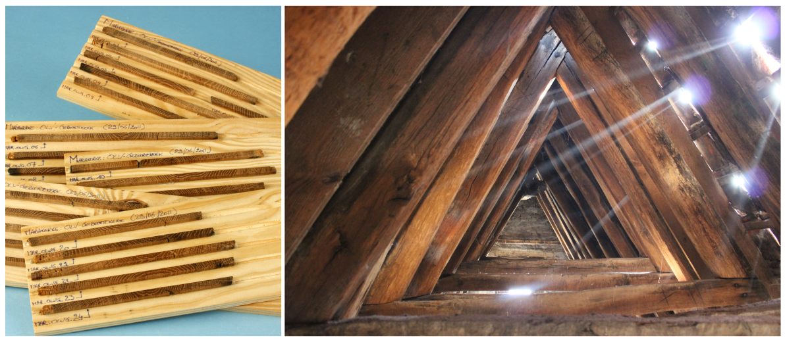
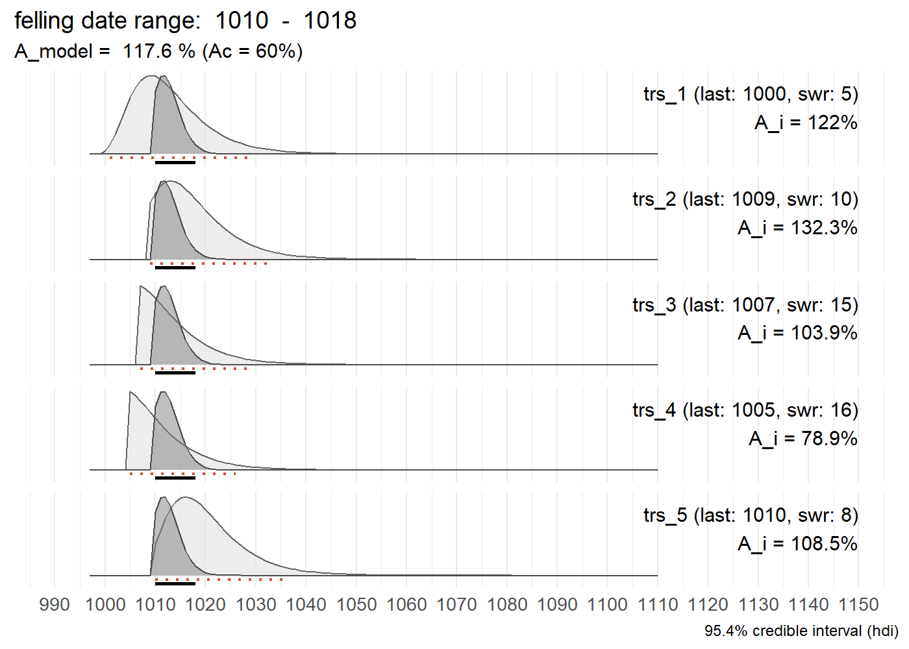
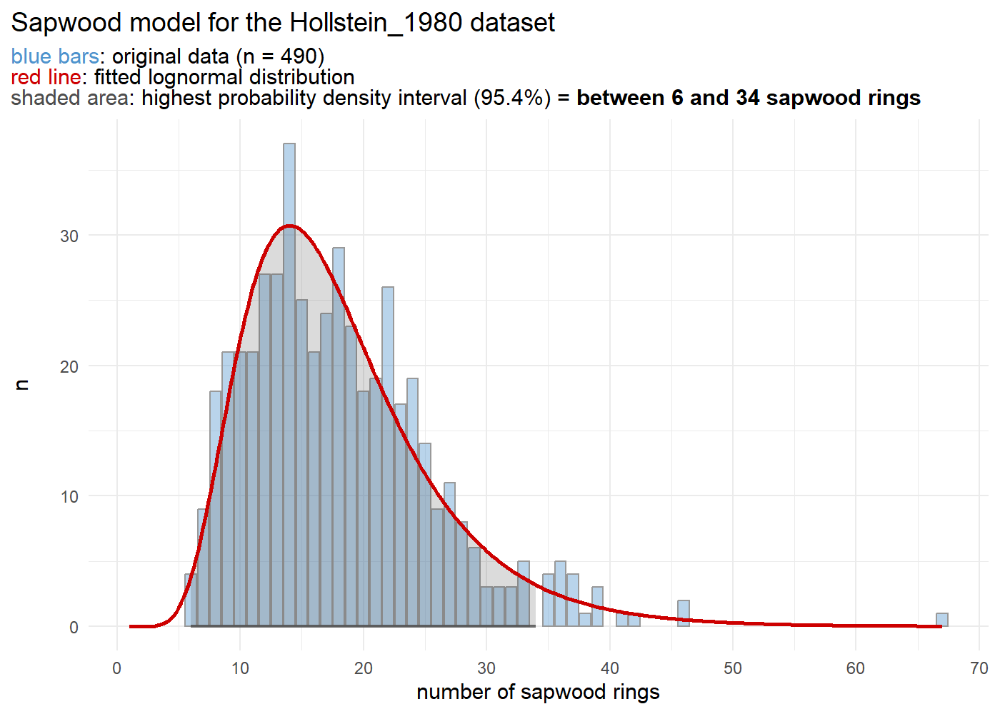

<!-- README.md is generated from README.Rmd. Please edit that file -->

# `fellingdateR`: Estimate, report and combine felling dates of historical tree-ring series

<!-- badges: start -->

[](https://github.com/hanecakr/fellingDateR/actions/workflows/R-CMD-check.yaml)
[](https://app.codecov.io/gh/hanecakr/fellingDateR?branch=master)
[](https://github.com/hanecakr/fellingDateR/actions?query=workflow%3Apkgcheck)
<!-- badges: end -->

This R-package offers a set of functions that can assist you to infer
felling date estimates from dated tree-ring series. The presence of
(partially) preserved sapwood or waney edge allows to estimate a range
for the actual felling date, for individual series as well as for a
group of timbers. Furthermore, an additional function provides a tool to
sum sapwood probability distributions, comparable to ‘summed probability
densities’ commonly applied to sets of radiocarbon (<sup>14</sup>C)
dates.



Where it can be assumed that a group of historical timbers were all
felled at the same time (i.e. in the same year), but due to the absence
of the bark/cambial zone (waney edge) and the last formed tree ring this
cannot be assessed, the preserved sapwood rings can be used to infer a
date range for the felling date.

Taking into account the observed number of sapwood rings on all samples
and combining them into a single estimate, is likely to provide a more
accurate and precise estimate of the felling date year for the group of
timbers under study.

## Installation

You can install the development version of fellingdateR from
[GitHub](https://github.com/) with:

``` r
#install.packages("pak")
pak::pak("hanecakr/fellingdateR")
```

## Basic example

In the following example the combined felling date range for a set of
five dated tree-ring series is computed:

``` r
library(fellingdateR)

## a data set where all series have partially preserved sapwood:
load("R/sysdata.rda")
trs_example1
#>   series last n_sapwood waneyedge
#> 1 trs_01 1000         5     FALSE
#> 2 trs_02 1009        10     FALSE
#> 3 trs_03 1007        15     FALSE
#> 4 trs_04 1005        16     FALSE
#> 5 trs_05 1010         8     FALSE
```

``` r
sw_combine(trs_example1, plot = TRUE)
```



The light grey distributions represent the probability density function
of the felling date range for each individual series. The dark grey
distribution is the combined estimate for a common felling date.

The sapwood data used in the example above to estimate the felling date
range, was published by Hollstein in 1980:

``` r
sw_model("Hollstein_1980")
```



## Getting started

An overview of the main functions and sapwood datasets included within
the package can be found
[here](https://hanecakr.github.io/fellingdateR/reference/).

Some examples are provided in the
[`getting started`](https://hanecakr.github.io/fellingdateR/articles/getting_started.html)
vignette.

## Motivation

This package was developed during the analysis of a large data set of
tree-ring series that originate from medieval timber constructions in
[Bruges](https://en.wikipedia.org/wiki/Bruges) (Belgium). The results of
this study were published in
[*Dendrochronologia*](https://www.journals.elsevier.com/dendrochronologia).

> Kristof HANECA
> [](https://orcid.org/0000-0002-7719-8305),
> Vincent DEBONNE, Patrick HOFFSUMMER 2020. The ups and downs of the
> building trade in a medieval city: tree-ring data as proxies for
> economic, social and demographic dynamics in Bruges (*c.* 1200 –
> 1500). *Dendrochronologia* 64, 125773.  
> <https://doi.org/10.1016/j.dendro.2020.125773>
