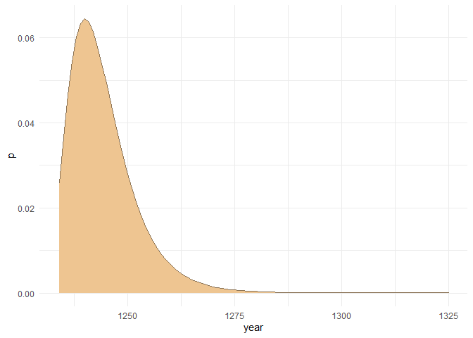
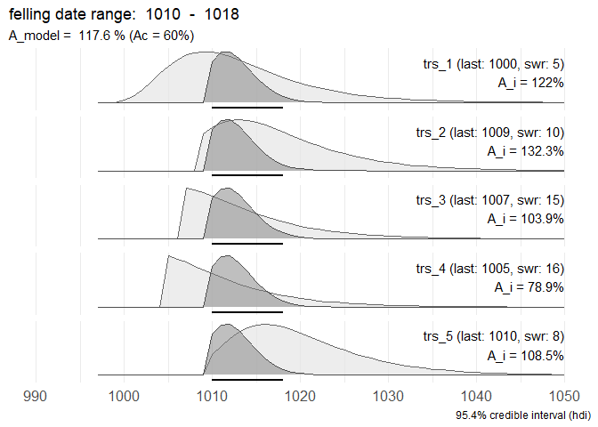
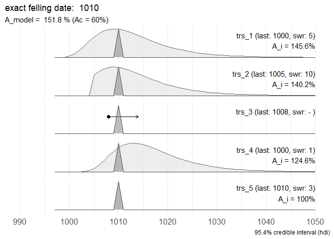
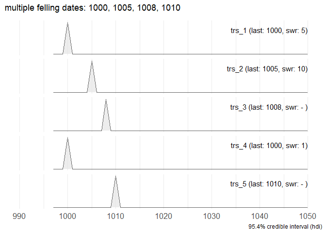
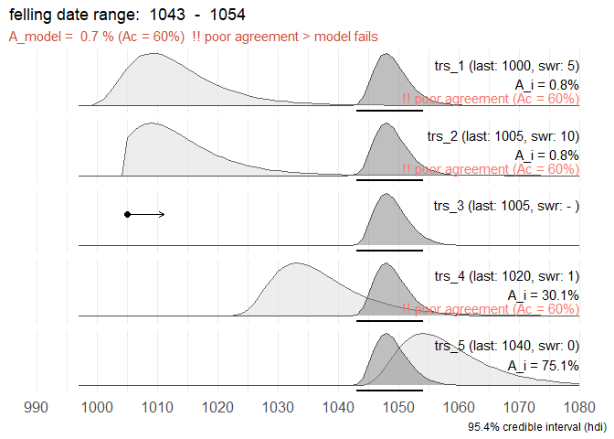
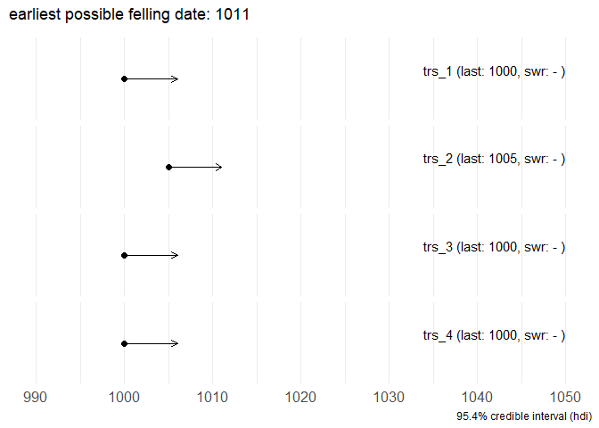
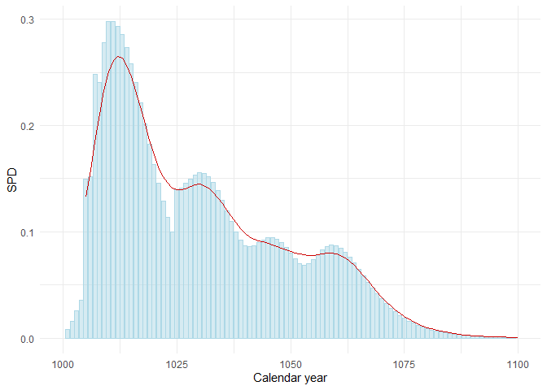

  - [fellingDateR: estimating felling dates from historical tree-ring
    series](#fellingdater-estimating-felling-dates-from-historical-tree-ring-series)
      - [Motivation](#motivation)
          - [Content](#content)
      - [Overview of sapwood
        R-functions](#overview-of-sapwood-r-functions)
          - [sapwood\_PDF](#sapwood_pdf)
          - [sapwood\_combine()](#sapwood_combine)
          - [sapwood\_comb\_plot()](#sapwood_comb_plot)
          - [sapwood\_SPD()](#sapwood_spd)

> <br/> Kristof Haneca<br/> 12 augustus, 2020<br/>
> 
> [](https://www.researchgate.net/profile/Kristof_Haneca)

# fellingDateR: estimating felling dates from historical tree-ring series

The set of functions presented on this Github repository will help you
to infer felling date estimates from dated tree-ring series with
partially preserved sapwood. Furthermore, an additional function
provides a tool to sum sapwood probability distributions, comparable to
‘summed probability densities’ commonly used for sets of radiocarbon
(<sup>14</sup>C) dates.

Where it can be assumed that a group of historical timbers were all
felled at the same time (i.e. the same year), but due to the absence of
the bark/cambial zone (waney edge) and the last formed tree ring this
cannot be assessed, the preserved sapwood rings on core samples can be
used to infer a date range for the felling date. Taking into account the
observed number of sapwood rings on all samples and combining them into
a single estimate, is likely to provide a more accurate and precise
estimate of the felling date year for the group of timbers under study.
It is assumed that this estimate of the felling date is closely related
to the construction date of the timber structure or building phase that
was sampled for tree-ring analysis and dating.

 © Flanders Heritage Agency

## Motivation

These R scripts and functions were developed during the analysis of a
large set of tree-ring data that originate from medieval timber
constructions in the town of
[Bruges](https://en.wikipedia.org/wiki/Bruges) (Belgium). The results of
this study are presented in a paper that is submitted to
[*Dendrochronologia*](https://www.journals.elsevier.com/dendrochronologia)
and is currently under peer review.

> Kristof HANECA
> [](https://orcid.org/0000-0002-7719-8305),
> Vincent DEBONNE, Patrick HOFFSUMMER, (under review). The ups and downs
> of the building trade in a medieval city: tree-ring data as proxies
> for economic, social and demographic dynamics in Bruges (c. 1200 –
> 1500). *Dendrochronologia*.

### Content

The [:file\_folder: R](/R) directory contains the R-script for each
function.

## Overview of sapwood R-functions

### sapwood\_PDF

The function `sapwood_PDF()` computes the probability density function
(PDF) for the estimated felling dated, derived from the number of
observed sapwood rings, on a core sample or cross section of a timber,
and a chosen sapwood model that gives the probability for any number of
sapwood rings (as observed on samples with a complete pith to bark
sequence).

The examples below all rely on published sapwood models for European oak
(*Quercus robur* L. and *Quercus petraea* (Matt.) Liebl.).

The `sapwood_PDF()`-function takes 5 arguments:

  - `swr` = the observed number of sapwood rings on a timber
  - `last` = a calendar date for the last measured tree ring on a
    dendrochronologically dated sample (optional)
  - `model` = should be one of `c("Holstein_1980", "Wazny_1990")` (more
    models will be added later)
  - `hdi` = `TRUE/FALSE` whether the highest probability density
    interval (hdi) should be computed or not (relies on package
    `HDInterval`)
  - `credMass` = number \[0, 1\] that assigns the credibility mass
    associated with the hdi, e.g. 0.95

Output is a `data.frame` with 3 variables:

  - `year`: ascending sequence staring at 0 when `last` is not set to a
    calendar year, or starting from the calendar year of the last
    observed sapwood ring
  - `swr`: ascending sequence starting at the observed number of sapwood
    rings
  - `p`: probability associated with the number of sapwood rings
    (`swr`), based on the sapwood model provided

<!-- end list -->

``` r
source("./R/sapwood_PDF.R")
require(tidyverse)

# 8 sapwood rings observed and the Hollstein 1980 sapwood model:

sw1 <- sapwood_PDF(swr = 8, last = 1234, model = "Hollstein_1980")

# plot the probability distribution of the 'truncated' sapwood model:

ggplot(sw1) +
  geom_area(aes(x = year, y = p), fill = "burlywood2", color = "burlywood4") +
  theme_minimal()
```

<!-- -->

The hdi delineates an interval in which the actual felling date is most
likely situated. It is the shortest interval within a probability
distribution for a given probability mass or credible interval. The hdi
summarizes the distribution by specifying an interval that spans most of
the distribution, say 95% of it, as such that every point inside the
interval has higher credibility than any point outside the interval.

In the example below, 10 sapwood rings were observed on a sample (last
ring dated to 1234 AD) that is supposed to have a provenance in the
Southern Baltic region (sapwood model published by Wazny, 1990). The
full sapwwood model is shown with a black outline. The highlighted part
of the distribution shows the truncated distribution at 10 observed
sapwood rings and the horizontal line depicts the 95.4% credible
interval for the felling date of the tree.

``` r
library(HDInterval) 
# this package assist in computing the highest probability density interval
# https://CRAN.R-project.org/package=HDInterval 

# the 'full' sapwood model (Wazny 1990)
sw2 <- sapwood_PDF(swr = 0, last = 1224, model = "Wazny_1990")

# the 'truncated' sapwood model when 7 sapwood rings are observed
sw3 <- sapwood_PDF(swr = 10, last = 1234, model = "Wazny_1990")

# the highest probability density interval (hdi), with a credible interval of 95.4%
sw4 <- sapwood_PDF(swr = 10, last = 1234, hdi = TRUE, credMass = 0.954, model = "Wazny_1990")

sw4
#> lower upper 
#>  1234  1250 
#> attr(,"credMass")
#> [1] 0.954
#> attr(,"sapwood_model")
#> [1] "Wazny_1990"
```

``` r
ggplot(sw2) +
  geom_area(aes(x = year, y = p), fill = NA, color = "black") +
  geom_area(data = sw3, aes(x = year, y = p), fill = "burlywood2", color = "burlywood4") +
  geom_segment(aes(y = .005, yend = .005, x = sw4["lower"], xend = sw4["upper"])) +
  theme_minimal()
```

<!-- -->

### sapwood\_combine()

This function attemps to estimate the shared felling date for a set of
dated tree-ring series with (partly) preserved sapwood.

The `sapwood_combine()`-function takes 4 arguments:

  - data = a `data.frame` with 4 columns
    
      - first column: character vector with unique keycodes for the
        (dated) tree-ring series
      - second column: numeric vector with the end dates (calendar year
        of the last tree-ring) for each tree- ring series
      - third column: the observed number of sapwood rings on each
        examined sample
      - fourth column: logical vector TRUE/FALSE to indicate if waney
        edge/last ring is present

  - `hdi` = `TRUE/FALSE` whether the highest probability density
    interval (hdi) for the shared felling date should be computed or
    not. If FALSE, ony the raw output is returned

  - `credMass` = number \[0, 1\] that assigns the credibility mass
    associated with the hdi, e.g. 0.95

  - `model` = should be one of `c("Holstein_1980", "Wazny_1990")` (more
    models will be added later)

<!-- end list -->

``` r
# First, some example datasets are created:

## a dataset where all series have partially preserved sapwood
dummy1 <- data.frame(
  keycode = c("trs_1", "trs_2", "trs_3", "trs_4", "trs_5"),
  Date_end = c(1000, 1009, 1007, 1005, 1010),
  SWR = c(5, 10, 15, 16, 8),
  Waneyedge = c(FALSE, FALSE, FALSE, FALSE, FALSE))

## a dataset in which one series has an exact felling date (= waney edge preserved)
dummy2 <- data.frame(
  keycode = c("trs_1", "trs_2", "trs_3", "trs_4", "trs_5"),
  Date_end = c(1000, 1005, 1008, 1000, 1010),
  SWR = c(5, 10, NA, 1, 3),
  Waneyedge = c(FALSE, FALSE, FALSE, FALSE, TRUE))

## a dataset with multiple exact felling dates
dummy3 <- data.frame(
  keycode = c("trs_1", "trs_2", "trs_3", "trs_4", "trs_5"),
  Date_end = c(1000, 1005, 1008, 1000, 1010),
  SWR = c(5, 10, NA, 1, NA),
  Waneyedge = c(TRUE, TRUE, TRUE, TRUE, TRUE))

## a combination of series with and without sapwood rings
dummy4 <- data.frame(
  keycode = c("trs_1", "trs_2", "trs_3", "trs_4", "trs_5"),
  Date_end = c(1000, 1005, 1005, 1020, 1040),
  SWR = c(5, 10, NA, 1, 0),
  Waneyedge = c(FALSE, FALSE, FALSE, FALSE, FALSE))

## this dataset contains series without preserved sapwood 
dummy5 <- data.frame(
  keycode = c("trs_1", "trs_2", "trs_3", "trs_4"),
  Date_end = c(1000, 1005, 1000, 1000),
  SWR = c(NA, NA, NA, NA),
  Waneyedge = c(FALSE, FALSE, FALSE, FALSE))
  
```

The output generated by `sapwood_combine()` when `hdi` is TRUE is a
list:

``` r
source("./R/sapwood_combine.R")

swc1 <- sapwood_combine(dummy1, hdi = TRUE, credMass = .90, model = "Hollstein_1980")

str(swc1)
#> List of 6
#>  $ rawData  :'data.frame':   114 obs. of  7 variables:
#>   ..$ year : num [1:114] 997 998 999 1000 1001 ...
#>   ..$ trs_1: num [1:114] 0 0 0 0.00292 0.00785 ...
#>   ..$ trs_2: num [1:114] 0 0 0 0 0 0 0 0 0 0 ...
#>   ..$ trs_3: num [1:114] 0 0 0 0 0 0 0 0 0 0 ...
#>   ..$ trs_4: num [1:114] 0 0 0 0 0 ...
#>   ..$ trs_5: num [1:114] 0 0 0 0 0 0 0 0 0 0 ...
#>   ..$ COMB : num [1:114] 0 0 0 0 0 0 0 0 0 0 ...
#>  $ A_c      : Named num 60
#>   ..- attr(*, "names")= chr "Ac: critical threshold (%)"
#>  $ A_comb   : Named num 118
#>   ..- attr(*, "names")= chr "A_comb"
#>  $ hdi_model: Named num [1:2] 1010 1016
#>   ..- attr(*, "names")= chr [1:2] "lower" "upper"
#>   ..- attr(*, "credMass")= num 0.9
#>   ..- attr(*, "sapwood_model")= chr "Hollstein_1980"
#>  $ summary  : chr [1:5, 1:5] "trs_1" "trs_2" "trs_3" "trs_4" ...
#>   ..- attr(*, "dimnames")=List of 2
#>   .. ..$ : chr [1:5] "trs_1" "trs_2" "trs_3" "trs_4" ...
#>   .. ..$ : chr [1:5] "series" "endDate" "swr" "waneyEdge" ...
#>  $ message  : chr "felling date range:  1010  -  1016"
```

### sapwood\_comb\_plot()

`sapwood_comb_plot()` provides an easy-to-use function to compute and
simultaneously plot the output of `sapwood_combine()` with `ggplot()`.

For each individual series the probability density for the number of
observed sapwood rings (i.e. the date range in which the actual felling
date is situated) is displayed, according to the chosen sapwood model.
The combined probability density for the shared felling date is
highlighted in dark grey. A horizontal line delineates the *highest
probability density interval* (hdi) according to the chosen credible
interval (`credMass`).

The `dummy1` set of simulated tree-ring series might share a common
felling date. According to the `sapwood_combine()` output this shared
felling date is situated between 1010 and 1018 AD.

``` r
source("./R/sapwood_comb_plot.R")

sapwood_comb_plot(dummy1, credMass = .954, model = "Hollstein_1980")
```

<!-- -->

When the waney edge is preserved and the tree-ring series can be dated,
an exact felling date can be determined. When grouped with other series
from the same building phase, it can be assessed whether the other
series with preserved sapwood rings go together with this exact felling
date.

``` r

sapwood_comb_plot(dummy2, credMass = .954, model = "Hollstein_1980")
```

<!-- -->

Series *trs\_3* has no preserved sapwood. The arrow points away from the
earliest possible felling date for this tree-ring series.

`dummy_3` is a simulated data set with series that have different
felling dates. Hence, no common felling date can be presented.

``` r

sapwood_comb_plot(dummy3, credMass = .954, model = "Hollstein_1980")
```

<!-- -->

For this set of tree-ring series, no common felling date can be
estimated. Probably this dataset contains tree-ring series from
different building phases or includes reused, older timbers.

``` r

sapwood_comb_plot(dummy4, credMass = .954, model = "Hollstein_1980")
```

<!-- -->

Ony a *terminus post quem* or ‘earliest possible felling date’ can be
computed when no sapwood is preserved.

``` r

sapwood_comb_plot(dummy5, credMass = .954, model = "Hollstein_1980")
```

<!-- -->

### sapwood\_SPD()

Computes a *summed probability density* for a set of tree-ring series
with (partly) preserved sapwood.

First the PDF for the estimated felling date for each individual series
with (partly) preserved sapwood and/or waney edge is computed. Then the
summed probability density (SPD) is computed as the sum of all
probabilities associated with each individual calendar year. Optionally,
a moving average/running mean of the SPD is added to the output
(`run_mean = TRUE`) with a chosen bandwidth (`w = 11` in the example
below).

``` r
source("./R/sapwood_SPD.R")
source("./R/MovAv.R")

dummy6 <- data.frame(
  keycode = c("trs_1", "trs_2", "trs_3", "trs_4", "trs_5", "trs_6", "trs_7", "trs_8", "trs_9"),
  Date_end = c(1000, 1009, 1007, 1005, 1010, 1020, 1025, 1050, 1035),
  SWR = c(5, 10, 15, 16, 8, 0, 10, 3, 1),
  Waneyedge = c(FALSE, FALSE, FALSE, FALSE, FALSE, FALSE, FALSE, FALSE, FALSE)
  )

# Compute the summed probability density for the `dummy6` data set. 
# The resulting SPD is not scaled to 1 and a running mean with a bandwidth of 11 years is added.

spd <- sapwood_SPD(dummy6, scale_p = FALSE, run_mean = TRUE, w = 11)

head(spd, 15)
#>    year       trs_1      trs_2      trs_3      trs_4      trs_5 trs_6 trs_7
#> 1  1000 0.002920056         NA         NA         NA         NA    NA    NA
#> 2  1001 0.007851331         NA         NA         NA         NA    NA    NA
#> 3  1002 0.015599371         NA         NA         NA         NA    NA    NA
#> 4  1003 0.025306639         NA         NA         NA         NA    NA    NA
#> 5  1004 0.035602028         NA         NA         NA         NA    NA    NA
#> 6  1005 0.045144935         NA         NA 0.10472744         NA    NA    NA
#> 7  1006 0.052957855         NA         NA 0.09893603         NA    NA    NA
#> 8  1007 0.058523428         NA 0.09804400 0.09196486         NA    NA    NA
#> 9  1008 0.061729360         NA 0.09445954 0.08434651         NA    NA    NA
#> 10 1009 0.062750383 0.04946195 0.08923594 0.07650058         NA    NA    NA
#> 11 1010 0.061926026 0.05802198 0.08294825 0.06874014 0.02599207    NA    NA
#> 12 1011 0.059662027 0.06411976 0.07607684 0.06128577 0.03656631    NA    NA
#> 13 1012 0.056362726 0.06763227 0.06900015 0.05428204 0.04636769    NA    NA
#> 14 1013 0.052391329 0.06875092 0.06200058 0.04781388 0.05439222    NA    NA
#> 15 1014 0.048051247 0.06784774 0.05527707 0.04192130 0.06010854    NA    NA
#>    trs_8 trs_9         SPD SPD_MovAv
#> 1     NA    NA 0.002920056        NA
#> 2     NA    NA 0.007851331        NA
#> 3     NA    NA 0.015599371        NA
#> 4     NA    NA 0.025306639        NA
#> 5     NA    NA 0.035602028        NA
#> 6     NA    NA 0.149872375 0.1321537
#> 7     NA    NA 0.151893883 0.1589529
#> 8     NA    NA 0.248532286 0.1849341
#> 9     NA    NA 0.240535416 0.2094568
#> 10    NA    NA 0.277948848 0.2319931
#> 11    NA    NA 0.297628468 0.2522040
#> 12    NA    NA 0.297710716 0.2604300
#> 13    NA    NA 0.293644867 0.2667485
#> 14    NA    NA 0.285348932 0.2625032
#> 15    NA    NA 0.273205888 0.2572127
```

Plot the output of `sapwood_SPD()`

``` r
library(ggformula) 
# for geom_spline()

spd %>%
select(year, SPD, SPD_MovAv) %>%
ggplot() +
  geom_col(aes(x = year, y = SPD), fill = "lightblue", color = "lightblue", alpha = 0.5) +
  geom_spline(aes(x = year, y = SPD_MovAv), nknots = 20, color = "red3") +
  xlim(1000, 1100) +
  xlab("Calendar year") +
  theme_minimal()
```

<!-- -->
