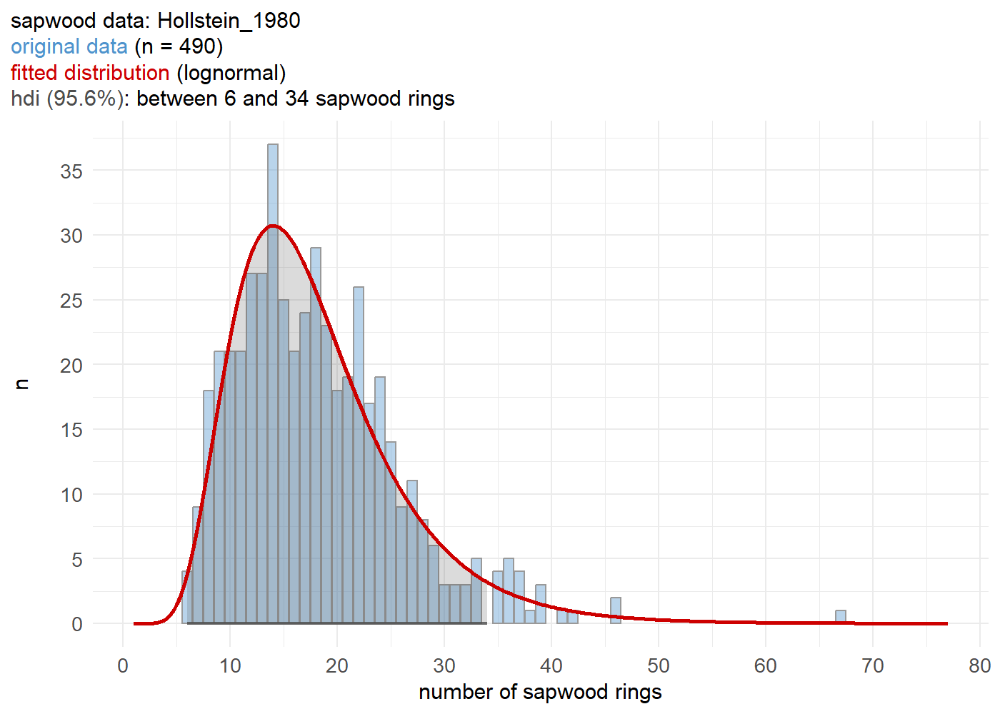

<!-- README.md is generated from README.Rmd. Please edit that file -->

# `fellingdateR`: estimating felling dates from historical tree-ring series

<!-- badges: start -->
<!-- badges: end -->

This R-package offers a set of functions that will help you to infer
felling date estimates from dated tree-ring series. The presence of
(partially) preserved sapwood or waney edge allows to estimate a range
for the actual felling date, for individual series as well as for a
group of timbers. Furthermore, an additional function provides a tool to
sum sapwood probability distributions, comparable to ‘summed probability
densities’ commonly applied to sets of radiocarbon (<sup>14</sup>C)
dates.

Where it can be assumed that a group of historical timbers were all
felled at the same time (i.e. the same year), but due to the absence of
the bark/cambial zone (waney edge) and the last formed tree ring this
cannot be assessed, the preserved sapwood rings can be used to infer a
date range for the felling date. Taking into account the observed number
of sapwood rings on all samples and combining them into a single
estimate, is likely to provide a more accurate and precise estimate of
the felling date year for the group of timbers under study. It is
assumed that this estimate of the felling date is closely related to the
construction date of the timber structure or building phase that was
sampled for tree-ring analysis and dating.

## Installation

You can install the development version of fellingddateR from
[GitHub](https://github.com/) with:

``` r
#install.packages("devtools")
devtools::install_github("hanecakr/fellingdateR")
```

## Examples

The following example shows a felling date estimate for a set of four
dated tree-ring series:

``` r
## a dataset where all series have partially preserved sapwood
dummy1 <- data.frame(
  series = c("trs_1", "trs_2", "trs_3", "trs_4", "trs_5"),
  last = c(1000, 1009, 1007, 1005, 1010),
  n_sapwood = c(5, 10, 15, 16, 8),
  waneyedge = c(FALSE, FALSE, FALSE, FALSE, FALSE))
dummy1
#>   series last n_sapwood waneyedge
#> 1  trs_1 1000         5     FALSE
#> 2  trs_2 1009        10     FALSE
#> 3  trs_3 1007        15     FALSE
#> 4  trs_4 1005        16     FALSE
#> 5  trs_5 1010         8     FALSE
```

``` r

library(fellingdateR)
# basic example

sw_combine(dummy1, plot = TRUE)
#> Warning: Using one column matrices in `filter()` was deprecated in dplyr 1.1.0.
#> ℹ Please use one dimensional logical vectors instead.
#> ℹ The deprecated feature was likely used in the dplyr package.
#>   Please report the issue at <]8;;https://github.com/tidyverse/dplyr/issueshttps://github.com/tidyverse/dplyr/issues]8;;>.
```


The sapwood data used in the example below was published by Hollstein in
1980:

``` r

sw_model("Hollstein_1980")
```



## Motivation

This package and and functions were developed during the analysis of a
large data set of tree-ring series that originate from medieval timber
constructions in the town of
[Bruges](https://en.wikipedia.org/wiki/Bruges) (Belgium). The results of
this study are presented in a paper published in
[*Dendrochronologia*](https://www.journals.elsevier.com/dendrochronologia).

> Kristof HANECA
> [](https://orcid.org/0000-0002-7719-8305),
> Vincent DEBONNE, Patrick HOFFSUMMER 2020. The ups and downs of the
> building trade in a medieval city: tree-ring data as proxies for
> economic, social and demographic dynamics in Bruges (*c.* 1200 –
> 1500). *Dendrochronologia* 64, 125773.  
> <https://doi.org/10.1016/j.dendro.2020.125773>

## Main functions

### sw_model

### sw_interval

This function computes the probability density function (PDF) and
highest probability density interval (hdi) of the felling date range
baased on the observed number of sapwood rings, their chronological
dating and the selected sapwood data and model.

``` r
# The following code computes the PDF of sapwood estimates, or limits of the hdi for the felling date.
# In the example below, 10 sapwood rings were observed on a sample (last ring dated to 1234 AD) that is supposed to have a provenance in the Southern Baltic  region (sapwood model published by Wazny, 1990).
# The hdi delineates an interval in which the actual felling date is most likely situated. It is the shortest interval within a probability distribution for a given probability mass or credible interval. The hdi summarizes the distribution by specifying an interval that spans most of the distribution, say 95% of it, as such that every point inside the interval has higher credibility than any point outside the interval.

sw_interval(n_sapwood = 10,
            last = 1234,
            hdi = TRUE,
            credMass = .95, 
            sw_data = "Wazny_1990", 
            densfun = "lognormal")
#>   lower upper         p
#> 1  1234  1250 0.9611797
```

When `hdi = FALSE` a matrix is returned with scaled p values for each
number of observed sapwood rings.

``` r
# 8 sapwood rings observed and the Hollstein 1980 sapwood model:
pdf <- sw_interval(n_sapwood = 10,
            last = 1234,
            hdi = FALSE,
            credMass = .95, 
            sw_data = "Wazny_1990", 
            densfun = "lognormal")

full <- sw_interval(n_sapwood = 0,
            last = 1224,
            hdi = FALSE,
            credMass = .95, 
            sw_data = "Wazny_1990", 
            densfun = "lognormal")

# plot the probability distribution of the 'truncated' sapwood model:
ggplot2::ggplot(pdf) +
  ggplot2::geom_area(ggplot2::aes(x = year, y = p), fill = "burlywood2", color = "burlywood4") +
  ggplot2::theme_minimal()
```


## fd_report

## sw_combine and sw_combine_plot

# Helper functions

## read_fh and get_header

## sw_model

## sw_data_overview

## sw_data_info
