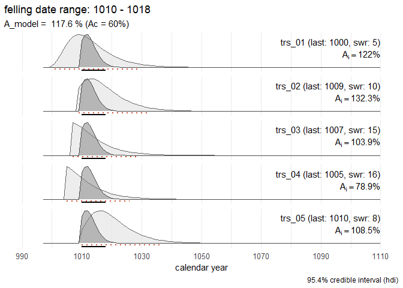

<!-- README.md is generated from README.Rmd. Please edit that file -->

# `fellingdateR`: Estimate, report and combine felling dates of historical tree-ring series

<!-- badges: start -->

[](https://github.com/hanecakr/fellingDateR/actions/workflows/R-CMD-check.yaml)
[](https://app.codecov.io/gh/hanecakr/fellingDateR?branch=main)
[](https://github.com/hanecakr/fellingDateR/actions?query=workflow%3Apkgcheck)
[](https://github.com/ropensci/software-review/issues/618)
<!-- badges: end -->

This R-package offers a suite of functions designed to assist
dendrochronologists in inferring estimates for felling dates, derived
from dated tree-ring series. The presence of partially preserved sapwood
(*sw*) allows to estimate the missing number of sapwood rings ( ? in
figure below), and to report an interval in which the actual felling
date (*fd*) likely falls.


This procedure can be applied to individual series as well as to a
collection of timbers.

In cases where it can be assumed that a group of historical timbers were
all felled simultaneously (i.e., in the same year), but due to the
absence of the bark/cambial zone (waney edge) and the final formed tree
ring, this cannot be determined, the preserved sapwood rings can be used
to establish a date range for the felling event.

Taking into account the observed number of sapwood rings across all
analysed samples and combining them into a single estimate, a more
accurate and precise estimation of the felling date year for the group
of timbers under study is likely to be obtained.

An additional function offers a tool for summing sapwood probability
distributions, comparable to ‘summed probability densities (SPD)’
commonly applied to sets of radiocarbon (<sup>14</sup>C) dates.

## Installation

You can install the development version of `fellingdateR` from
[GitHub](https://github.com/hanecakr/fellingdateR/) with:

``` r
#install.packages("pak")
pak::pak("hanecakr/fellingdateR")
```

## Basic example

In the following example the combined felling date range for a set of
five dated tree-ring series is computed:

``` r
library(fellingdateR)

## a data set where all series have partially preserved sapwood:
trs_example1
#>   series last n_sapwood waneyedge
#> 1 trs_01 1000         5     FALSE
#> 2 trs_02 1009        10     FALSE
#> 3 trs_03 1007        15     FALSE
#> 4 trs_04 1005        16     FALSE
#> 5 trs_05 1010         8     FALSE
```

``` r
sw_combine(trs_example1, plot = TRUE)
```



The light grey distributions represent the probability density function
of the felling date range for each individual series. The dark grey
distribution is the combined estimate for a common felling date.

The sapwood model used in the example above to estimate the felling date
range, was published by [Hollstein
(1980)](https://search.worldcat.org/nl/title/6391864):

``` r
sw_model("Hollstein_1980", plot = TRUE)
```


## Getting started

You can find an overview of the **main functions** and **sapwood
datasets** distributed with the package in the
[documentation](https://hanecakr.github.io/fellingdateR/reference/).

Some practical examples are provided in the
[`Get started`](https://hanecakr.github.io/fellingdateR/articles/getting_started.html)
vignette.

## The workflow

The `fellingdateR`-package allows to fully document the methodology to
establish a felling date – for a single timber or a group of timbers –
making the whole procedure reproducible. It assists in building
standardized workflows when applied to large datasets of historical
tree-ring series originating from geographically distinct regions. The
package is designed to offer several functions related to each step in
the (generalized) workflow when working with tree-ring series from
(pre-)historical objects or constructions.


## Motivation & citation

This package was developed during the analysis of a large data set of
tree-ring series originating from medieval timber constructions in
[Bruges](https://en.wikipedia.org/wiki/Bruges) (Belgium). The results of
this study were published in
[*Dendrochronologia*](https://www.journals.elsevier.com/dendrochronologia).

Please cite this paper when using the `fellingdateR` package:

> Kristof HANECA
> [](https://orcid.org/0000-0002-7719-8305),
> Vincent DEBONNE, Patrick HOFFSUMMER 2020. The ups and downs of the
> building trade in a medieval city: tree-ring data as proxies for
> economic, social and demographic dynamics in Bruges (*c.* 1200 –
> 1500). *Dendrochronologia* 64, 125773.  
> <https://doi.org/10.1016/j.dendro.2020.125773>

To refer to the current version of the package:

> Haneca K (2023). *fellingdateR: an R-package to facilitate the
> organisation, analysis and interpretation of tree-ring data from
> wooden heritage objects and structures*. R package, version
> 0.0.0.9003, <https://github.com/hanecakr/fellingDateR>.

## Comments and contributions

- Please report any issues or bugs here:
  <https://github.com/hanecakr/fellingdateR/issues>.

- Get citation information for `fellingdateR` in R typing
  `citation(package = 'fellingdateR')`.

- Please note that the `fellingdateR` package is released with a
  [Contributor Code of
  Conduct](https://github.com/hanecakr/fellingdateR/blob/main/.github/CONTRIBUTING.md).
  By contributing to this project, you agree to abide by its terms.
